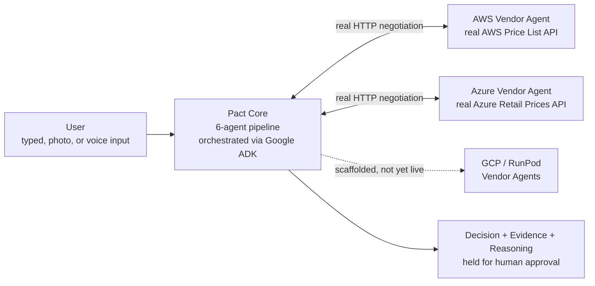
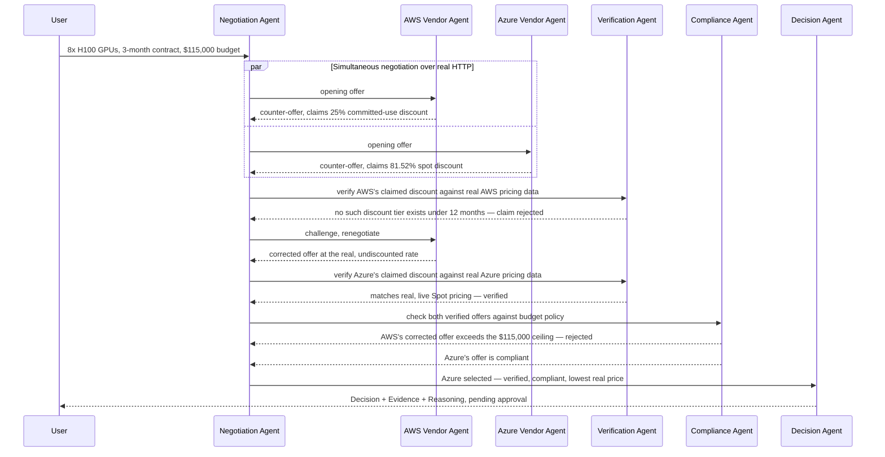

# Pact


Autonomous B2B procurement negotiation, where organizational agents
negotiate directly with other organizational agents, every claim is
independently verified, every decision is auditable, and every
recommendation is grounded in real evidence rather than a fabricated
score.

[Documentation](docs/PRD.md) · [Architecture](docs/ARCHITECTURE.md) · [Evidence](#evidence-the-flagship-scenario) · [Getting Started](#getting-started)

<!-- TODO: add screenshots before submission -->
<!-- Decision / Evidence / Reasoning view:  -->
<!-- Negotiation Replay timeline:  -->

## Table of Contents

1. [About](#about)
2. [What makes Pact different](#what-makes-pact-different)
3. [Core capabilities](#core-capabilities)
4. [Tech stack](#tech-stack)
5. [Architecture](#architecture)
6. [Evidence: the flagship scenario](#evidence-the-flagship-scenario)
7. [Project structure](#project-structure)
8. [Getting Started](#getting-started)
9. [Configuration](#configuration)
10. [Security](#security)
11. [Testing](#testing)
12. [Evaluation harness](#evaluation-harness)
13. [Deployment](#deployment)
14. [Current status / honest scope](#current-status--honest-scope)
15. [Roadmap](#roadmap)
16. [Contributing](#contributing)
17. [License](#license)
18. [Acknowledgements](#acknowledgements)
19. [Author](#author)

## About

Procurement teams with recurring vendor spend already run a version of
this process today — manually. A person reads each vendor's quote, tries
to negotiate against several suppliers at once (in practice, rarely at
the same time), and has no practical way to confirm a vendor's claimed
discount is real before signing. Existing procurement software mostly
digitizes the paperwork around that decision — tracking quotes, routing
approvals — without changing who actually negotiates or verifies
anything. A human still reads it and makes the call.

Pact moves the negotiation and claim-verification steps themselves into
an autonomous system. A Buyer Agent negotiates simultaneously with
independent Vendor Agents over real HTTP, an independent Verification
Agent checks every vendor claim against a live external data source
before it can affect the outcome, and a Compliance Agent enforces policy
as a hard gate that can override even the cheapest offer. A human is
retained only at the final approval boundary — not at every step in
between.

In its flagship scenario (8× H100 GPUs, 3-month contract, $115,000
budget), Pact negotiated with two real cloud vendors simultaneously,
caught a vendor's claimed discount as fabricated against that vendor's
own real pricing data, rejected that vendor's corrected offer anyway for
exceeding budget, and closed a real, verified, compliant deal at
**$39,246.20 — roughly 66% under the budget ceiling** — with every one
of those numbers traceable to a live public pricing API, not invented.
See [Evidence](#evidence-the-flagship-scenario) below.

### Key highlights

- **Autonomous negotiation, not negotiation assistance.** The agents do
  the negotiating, verifying, and evaluating; a human only approves the
  final result.
- **Nothing is trusted, everything is checked.** A vendor's claimed
  discount is treated as a negotiating position, not a fact, until an
  independent source confirms it.
- **Policy is a hard gate, not a suggestion.** A deal that violates
  budget, blocked-vendor, or certification policy is rejected — even if
  it's the cheapest offer on the table — and the negotiation continues.

## What makes Pact different

1. **Agents negotiate with agents, over a real transport.** The Buyer
   Agent and each Vendor Agent are genuinely separate HTTP services, not
   one application internally pretending to be several.
2. **Claims are verified, not just displayed.** Existing procurement
   tools show you whatever a vendor typed into a quote. Pact checks it
   against a live, independent pricing source before it can influence
   anything — a mismatch triggers renegotiation, not a silently accepted
   number.
3. **Policy can override price.** Even the cheapest verified offer is
   rejected if it violates an explicit constraint (budget, blocked
   vendor, missing certification), forcing renegotiation.
4. **Every recommendation carries evidence, never a bare score.** The
   final output is always Decision + Evidence + Reasoning, with each
   evidence item traceable to a real source — not a confidence
   percentage with nothing behind it.
5. **Pact measures itself with real numbers.** Where most tools would
   assert a savings percentage, Pact's evaluation harness runs a real
   scenario catalogue through the same pipeline as a live negotiation and
   computes aggregate statistics via SQL against actually-logged runs.

## Core capabilities

| Capability | What it does |
|---|---|
| Simultaneous multi-vendor negotiation | Negotiates with every discovered vendor at once over real HTTP, not sequentially |
| Independent claim verification | Every vendor claim is checked against a live external pricing source before it can affect the outcome |
| Policy enforcement | Budget ceilings, blocked vendors, and required certifications are hard gates a deal must pass |
| Evidence-backed decisions | Every recommendation ships as Decision + Evidence + Reasoning, each evidence item traceable to a real source |
| Human approval gate | No deal is ever finalized without an explicit, recorded approval action |
| Full negotiation replay | Every offer, verification check, compliance check, and renegotiation is a timestamped, reviewable timeline |
| Real evaluation harness | Runs a scenario catalogue through the live pipeline and computes real aggregate statistics via SQL |
| Photo/voice requirement intake | Extracts requirement fields from a photographed quote or a spoken transcript, never inventing a missing value |

## Tech stack

| Layer | Technology | Purpose |
|---|---|---|
| Backend | Python 3.11+ / FastAPI | pact-core API, agent orchestration |
| Frontend | React + TypeScript / Vite | Decision view, Replay timeline, requirement intake UI |
| Negotiation core | Pure Python, deterministic concession curve | Reservation price / BATNA / time-decay logic — no LLM ever sets a price |
| Agent orchestration | Google ADK (`SequentialAgent` + `Runner`) | Real orchestration of the Discovery and Negotiation/Verification/Compliance/Decision phases |
| Tool protocol | Model Context Protocol (official `mcp` SDK) | `pricing_lookup` / `verify_claim` exposed as real MCP tools over stdio |
| Vendor transport | Real HTTP between genuinely separate vendor services | A2A-inspired; the literal `a2a-sdk` was evaluated and is disclosed as not used — see [Current status](#current-status--honest-scope) |
| Verification data | AWS Price List Bulk API, Azure Retail Prices API | Live, public, keyless — the independent ground truth every claim is checked against |
| Reasoning & intake | Gemini (`gemini-flash-latest`) | Decision narration and photo/voice requirement extraction — never the price |
| Plausibility pre-screen | Gemma 3 4B, self-hosted via Ollama | Independent, fast pre-screen — never authoritative over the deterministic verdict |
| Persistence & analytics | Google BigQuery | Negotiation logs and evaluation-harness aggregate statistics |
| Deployment | Docker (single container) + ngrok | Cardless public URL — see [Deployment](#deployment) |

## Architecture



The six agents (Buyer, Discovery, Negotiation, Verification, Compliance,
Decision) and the full request/response sequence, including both
feedback loops, are diagrammed in detail in
[`docs/ARCHITECTURE.md`](docs/ARCHITECTURE.md). The sequence below is the
flagship scenario specifically, with only the two vendors that are
genuinely wired to live pricing data today:



## Evidence: the flagship scenario

Every figure below is fetched live from a public pricing API or computed
directly from it — reproduce it yourself with
`python scripts/run_scenario.py --fixture flagship --approve` (see
[Getting Started](#getting-started)).

**Claim verification**

| Vendor | Claimed | Checked against | Real value | Verdict |
|---|---|---|---|---|
| AWS | 25% committed-use discount, 3-month term | AWS Price List Bulk API | 0% — AWS's real Reserved Instance terms are 1-year and 3-year only; no 3-month tier exists | ❌ Rejected, renegotiated |
| Azure | 81.52% discount via Spot pricing | Azure Retail Prices API (live) | 81.52% — real, immediately-available Spot pricing, no minimum commitment | ✅ Verified |

**Final decision**

| | AWS (corrected) | Azure (selected) |
|---|---|---|
| Real 3-month price | $118,886.40 | $39,246.20 |
| Verified against real data | ✅ | ✅ |
| Within $115,000 budget | ❌ | ✅ |
| Outcome | Rejected on compliance grounds | Selected, pending human approval |

## Project structure

```
docs/                   PRD and architecture documentation
backend/
  pact/                 Core package: 6-agent pipeline, orchestration, API
    agents/             Buyer, Discovery, Negotiation, Verification, Compliance, Decision
    negotiation/         Deterministic concession-curve logic (no LLM in the price path)
    orchestration/        The pipeline (graph.py), state/event log, human approval gate
    mcp_tools/            pricing_lookup / verify_claim: core logic + a real MCP server exposing both as MCP tools
    adk/                   Real Google ADK orchestration of the pipeline (SequentialAgent + Runner)
    a2a/                  HTTP-based vendor transport (see Tech stack)
    models/               Shared data schemas + Gemini Vision requirement parser
    api/                  FastAPI routes (pact-core)
    main.py               pact-core entrypoint
  vendors/
    aws_vendor/            Real AWS Price List Bulk API integration
    azure_vendor/           Real, live Azure Retail Prices API integration
    gcp_vendor/, runpod_vendor/   Scaffolded, not yet wired to a real API
  eval/                   Scenario catalogue (PRD §18) + real aggregate results
  scripts/                run_scenario.py (single run), run_catalogue.py (evaluation harness)
  tests/                  unit / integration / e2e (failure_path/ is scaffolded, no tests written yet)
frontend/                 Vite + React + TypeScript UI (Decision view, Replay timeline)
infra/                    bigquery/ (schema + aggregate query), huggingface/ (deployment container)
```

## Getting Started

### Prerequisites

- Python 3.11+
- Node 18+
- [Ollama](https://ollama.com) running the `gemma3:4b` model — optional; without it, verification still runs correctly (the deterministic check is authoritative either way), it just skips the extra Gemma plausibility pre-screen

### 1. Clone & install

```bash
git clone https://github.com/maha-rk/pact.git
cd pact

# Backend
cd backend
python3 -m venv .venv
source .venv/bin/activate
pip install -e ".[dev]"

# Frontend
cd ../frontend
npm install
```

### 2. Configure Gemini (optional but recommended)

```bash
cd backend
cp .env.example .env
# edit .env, set GEMINI_API_KEY to a real key from https://aistudio.google.com
```

Without a key, the Decision Agent still produces a correct, evidence-backed
reasoning statement from a deterministic template — Gemini only narrates
the same facts in richer natural language (PRD §16), and its role is
strictly narration, never determining a price, a verification verdict, or
a compliance verdict. If the Gemini call fails or times out for any
reason, the system falls back to the deterministic template automatically
and logs a `narration_degraded` event rather than blocking the decision
(PRD §27). The same key also powers the photo/voice requirement intake
(FR-1).

### 3. Run it

Three backend services, then the frontend — four terminals, or run each with `&`:

```bash
cd backend && source .venv/bin/activate
uvicorn vendors.aws_vendor.app:app --port 9001    # AWS vendor (real AWS Price List Bulk API)
uvicorn vendors.azure_vendor.app:app --port 9002   # Azure vendor (real Azure Retail Prices API)
uvicorn pact.main:app --port 8000                  # pact-core API

cd frontend
npm run dev   # http://localhost:5173
```

Open `http://localhost:5173`. The form is pre-filled with the PRD's
Flagship Demonstration Scenario (8× H100, 3-month contract, $115,000
budget). Click **Start negotiation** to run it live against the real AWS
and Azure vendor services.

Instead of the pre-filled form, you can also populate it from a photo of
a quote/invoice (**📷 Upload a photo of a quote/invoice**) or by speaking
the requirement out loud (**🎙️ Speak your requirement**, Chrome/Edge
only) — both call real Gemini Vision to extract fields (FR-1; requires
`GEMINI_API_KEY`) and pre-fill the form for you to review before starting
a negotiation.

### Or drive the API directly

```bash
curl -X POST http://localhost:8000/negotiations \
  -H "Content-Type: application/json" \
  -d '{
    "gpu_count": 8, "contract_months": 3, "budget_ceiling_usd": 115000,
    "raw_input": "Need 8 H100 GPUs, 3-month contract, $115,000 budget",
    "initial_claimed_discounts": {"aws": 0.25, "azure": 0.8152}
  }'
```

### Or run one scenario from the CLI, without any servers

```bash
cd backend && source .venv/bin/activate
python scripts/run_scenario.py --fixture flagship --approve
```

### Or run the real MCP server standalone

```bash
cd backend && source .venv/bin/activate
python -m pact.mcp_tools.server   # speaks real MCP over stdio; connect any MCP client
```

## Configuration

| Variable | Where | Required | Description |
|---|---|---|---|
| `GEMINI_API_KEY` | `backend/.env` | Optional (recommended) | Enables Gemini narration and photo/voice requirement intake (FR-1). Falls back to a deterministic reasoning template if absent — never blocks a negotiation. |

## Security

- **No payment or card information is required anywhere.** The
  deployment path (Docker + ngrok, see [Deployment](#deployment)) was
  deliberately chosen over billing-gated infrastructure for this reason.
- **Vendor pricing data is public by construction** — both live pricing
  sources are public, keyless APIs; no private or credentialed vendor
  data is accessed.
- **No end-user personal data is required** for the core negotiation
  flow — a requirement is a business specification (budget, capacity,
  contract terms), not personal information (PRD §26).
- **API credentials are server-side only.** `GEMINI_API_KEY` is loaded
  from a gitignored `.env` file, never exposed to the frontend or logged
  in plaintext.
- **CORS is restricted** to the known local frontend origins
  (`localhost:5173`, `localhost:3000`).
- **Explicit non-claim**: no formal security certification, penetration
  testing, or compliance audit has been performed or is claimed
  (PRD §26).

## Testing

```bash
cd backend && source .venv/bin/activate
pytest tests/
```

| Layer | Count | What it proves |
|---|---|---|
| Unit | 13 | Deterministic concession-curve math, compliance rule matching — no external calls |
| Integration | 19 | Real AWS/Azure pricing APIs, a real MCP protocol round-trip over stdio (subprocess), real Gemini narration and Vision calls, genuinely separate vendor services negotiating over real HTTP, the full API lifecycle |
| E2E | 12 | The full flagship scenario end to end — both via the direct pipeline and via the real ADK agent tree — plus the full scenario catalogue |
| **Total** | **44** | |

None of the integration or e2e tests mock the external APIs — they hit
real AWS, real Azure, and (when a key is configured) the real Gemini API,
which is why that layer takes a few seconds longer than a typical unit
suite: it's proving the system works against the outside world, not
against a stand-in for it.

## Evaluation harness

```bash
cd backend && source .venv/bin/activate
python scripts/run_catalogue.py
```

Runs every scenario in `eval/scenario_catalogue.yaml` through the exact
same pipeline code path as a live negotiation, prints a results table,
writes real (not invented) aggregate statistics — agreement rate, average
rounds-to-agreement, average savings, claim/compliance catch rates — to
`eval/results.json`, and sinks every run to the same BigQuery tables the
live API writes to. Run the real SQL aggregate query against actual
logged data with:

```bash
bq query --project_id=pact-hackathon --use_legacy_sql=false < ../infra/bigquery/queries_aggregate.sql
```

## Deployment

**Cloud Run was not used.** It requires a linked billing account (even
though actual usage would very likely stay within the free tier) — this
build deliberately avoids requiring payment info anywhere, including
here.

Instead: `infra/huggingface/Dockerfile` builds a single container running
all three backend services plus the built frontend behind one port
(7860), tested and confirmed working locally. Hugging Face Spaces was
evaluated as a free host for that container next, but its Docker SDK
turned out to require a paid PRO subscription on their current pricing —
also ruled out for the same no-payment reason.

The container is instead exposed via **ngrok** (free account + authtoken,
no card) for a real, working public URL:

```bash
docker build -f infra/huggingface/Dockerfile -t pact-deploy .
docker run -d --name pact-deploy-run -p 7860:7860 -e GEMINI_API_KEY="<key>" pact-deploy
ngrok http 7860
```

This is a real, live, working deployment — verified end to end (health
check, frontend, and a full negotiation with correct results) over the
actual public internet, not just localhost. Two honest caveats: it runs
on the operator's own machine rather than a managed cloud host (the
container must stay running for the URL to work), and ngrok's free tier
issues a new random subdomain each time the tunnel restarts, and shows
first-time visitors a one-click interstitial page before reaching the
app. Both are disclosed limitations of the no-payment path chosen here,
not attempts to hide them.

## Current status / honest scope

<details>
<summary>Full breakdown of what's genuinely live versus not (click to expand)</summary>

This build implements the PRD's Flagship Demonstration Scenario and the
full negotiation pipeline end to end, verified against real external
data. What's real right now:

- Deterministic negotiation core, all 6 agents, both feedback loops
- Real AWS pricing (Price List Bulk API) and real Azure pricing (Retail
  Prices API, including real spot pricing) — no mocks, no fixtures, in
  the live path
- Genuinely separate vendor services negotiating over real HTTP
- The human approval gate (nothing finalizes without it)
- The evaluation harness, computing real statistics from real runs
- **Gemini** — real narration of the Decision Agent's reasoning
  (`pact/models/gemini_client.py`), strictly isolated from the
  price-decision path; bounded to a 10s timeout with one retry, and
  degrades to a deterministic template (logged as `narration_degraded`,
  never silent) if the call fails — verified working both ways against
  the live API, including under a real transient Gemini outage during
  development
- **Gemma** — real, self-hosted (local Ollama) plausibility pre-screen on
  every vendor claim (`pact/models/gemma_client.py`), logged as its own
  `plausibility_screened` event — explicitly independent of, and never
  authoritative over, the deterministic verification verdict that
  actually gates the negotiation (FR-4's reproducibility guarantee is
  preserved: an LLM never decides match/mismatch)
- **BigQuery** — real project (`pact-hackathon`), real dataset/tables
  (`infra/bigquery/schema.sql`), written via batch load jobs (the
  no-billing-account-required path — streaming inserts need billing
  enabled, load jobs don't). Both the live API and the evaluation harness
  write to the same tables; `infra/bigquery/queries_aggregate.sql` computes
  real aggregate statistics via SQL against actual logged runs. API writes
  run as a FastAPI background task so a slow load job never holds up the
  HTTP response.
- **MCP** — `pact/mcp_tools/server.py` is a real MCP server (the official
  `mcp` SDK, v2.0+), exposing `pricing_lookup` and `verify_claim` as
  genuine MCP tools over the real stdio protocol, backed by the same real
  AWS/Azure pricing clients the live negotiation pipeline uses — not just
  a Protocol-shaped module named after the concept. Proven with a real
  client integration test (`tests/integration/test_mcp_server.py`) that
  spawns the server as an actual subprocess, calls `list_tools()` /
  `call_tool()` over the wire via the official client SDK, and asserts on
  real AWS pricing and the real flagship claim-mismatch — no in-process
  shortcuts. `pact/mcp_tools/pricing_tool.py` and `verification_tool.py`
  remain the plain-Python core logic these MCP tools wrap; the pipeline
  itself still calls that core logic directly (in-process, for latency),
  while the MCP server exposes the same logic to any external MCP client.
- **Google ADK** — `pact/adk/pipeline.py` runs the negotiation pipeline
  through a real ADK `SequentialAgent` under a real ADK `Runner` and
  `InMemorySessionService`, composed of two genuinely separate ADK
  agents (Discovery, then Negotiation/Verification/Compliance/Decision —
  the natural phase boundary, since verification and compliance are
  checked per-offer inside each live negotiation round, not as
  independently-scheduled steps). Both ADK agents call the exact same
  phase functions `orchestration/graph.py`'s direct path calls — one
  source of truth for the negotiation logic, proven identical via
  `tests/e2e/test_flagship_scenario_via_adk.py`, which runs the flagship
  scenario through the real ADK agent tree and asserts the same verified
  numbers as the direct path, plus that the two ADK agents genuinely ran
  in order. `orchestration/graph.run_negotiation` remains what the live
  API, CLI, and every other test call directly.
- **Gemini Vision — photo/voice requirement intake (FR-1)** —
  `pact/models/requirement_parser.py` calls real Gemini Vision (structured
  JSON output via `response_json_schema`) to extract `gpu_count`,
  `contract_months`, `budget_ceiling_usd`, `gpu_type`, and `region` from
  either a photographed quote/invoice or a text transcript, exposed via
  `POST /requirements/parse-image` and `POST /requirements/parse-text`.
  The model is explicitly instructed to return `null` for any field not
  actually present in the input rather than guess — verified against the
  real API with a rendered synthetic invoice image (correctly extracted
  8 GPUs / 3 months / $115,000) and against ambiguous text (correctly
  returned all-null when nothing concrete was stated), in
  `tests/integration/test_requirement_parser.py`. The frontend's "Upload a
  photo" button sends an image straight to the image endpoint; "Speak your
  requirement" uses the browser's native `SpeechRecognition` API to get a
  transcript (a real, working speech-to-text conversion, not a stub), then
  sends that transcript to the text endpoint. Either way, extracted fields
  only pre-fill the existing form for the user to review — nothing is
  auto-submitted, preserving both the human-in-the-loop framing and the
  "no invented value" acceptance criterion.

Not yet wired into the running system — see [Roadmap](#roadmap) below,
and `docs/PRD.md` §11's Google Technology Stack table for the intended
role of each. Nothing in this section is faked to appear more complete
than it is — see `docs/PRD.md` §32 for the project's explicit non-claims.

</details>

## Roadmap

- [ ] GCP and RunPod vendor integrations, wired to their real pricing APIs
- [ ] Gemini narration of individual negotiation moves in real time, not
      just the final Reasoning statement
- [ ] Vertex AI as Gemini's production serving backbone — requires a
      billing-enabled GCP project, deliberately deferred to avoid
      requiring payment info during the build
- [ ] Managed cloud hosting once a genuinely free, cardless option exists
      (Cloud Run and Hugging Face Spaces were both evaluated and ruled
      out for requiring billing — see [Deployment](#deployment))

## Contributing

This is a solo competition build, but the usual flow applies if you'd
like to extend it: fork the repo, create a feature branch, and open a
pull request. Before submitting, run `pytest tests/` in `backend/` and
`npx tsc --noEmit` in `frontend/`.

## License

MIT — see [LICENSE](LICENSE).

## Acknowledgements

- AI Agent Builder Series 2026 — the program this was built for
- [AWS Price List Bulk API](https://docs.aws.amazon.com/awsaccountbilling/latest/aboutv2/using-price-list-query-api.html) and [Azure Retail Prices API](https://learn.microsoft.com/en-us/rest/api/cost-management/retail-prices/azure-retail-prices) — the real, public, keyless pricing data this whole build is grounded in
- [Google AI Studio](https://aistudio.google.com) — Gemini API access used throughout the build
- The [Model Context Protocol](https://modelcontextprotocol.io) and [Google Agent Development Kit](https://google.github.io/adk-docs/) open-source SDKs

## Author

**Mahashri RK**
- GitHub: [@maha-rk](https://github.com/maha-rk)
