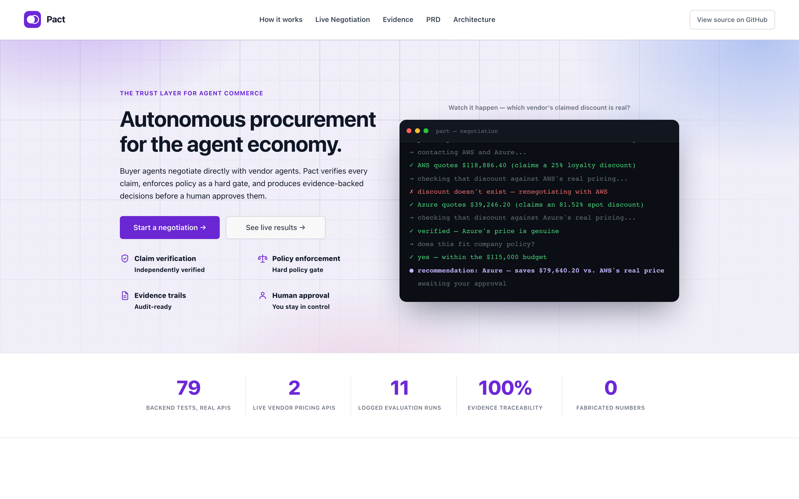
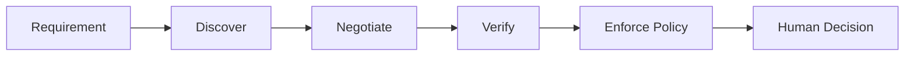
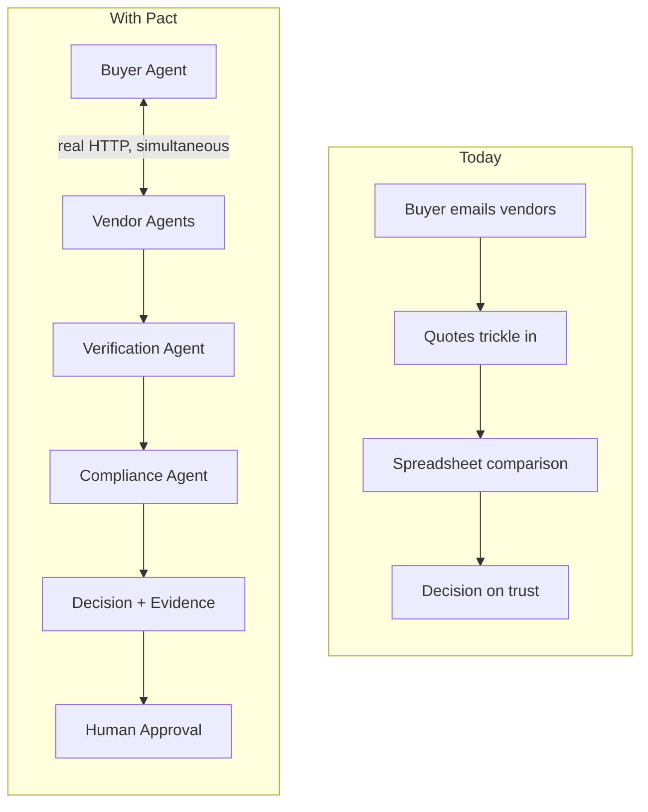
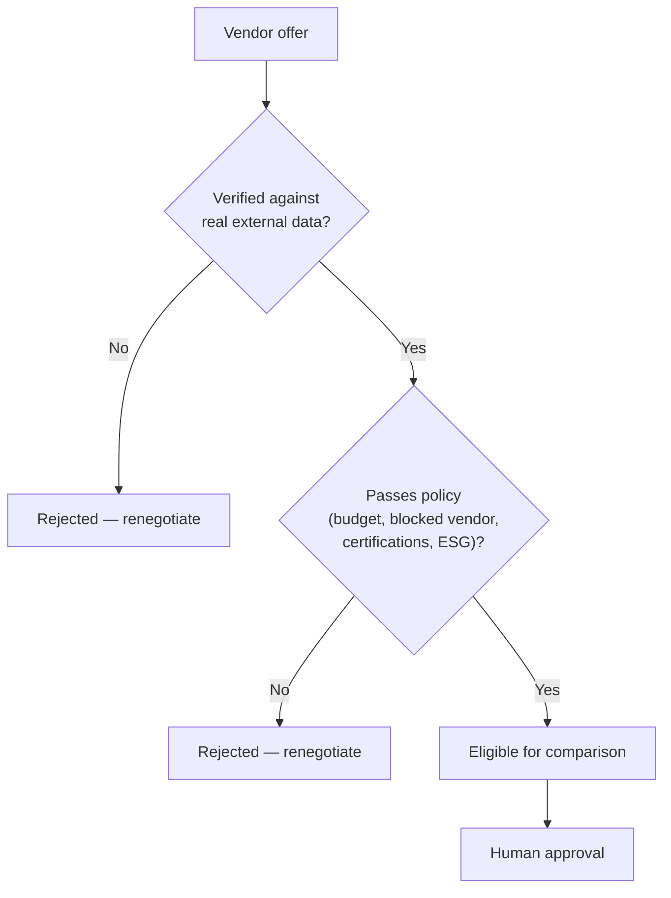
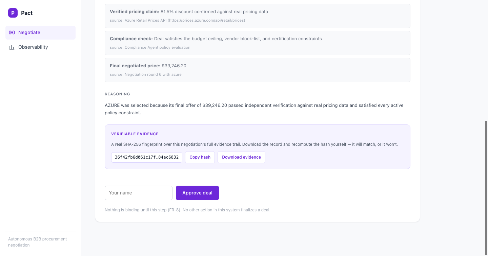
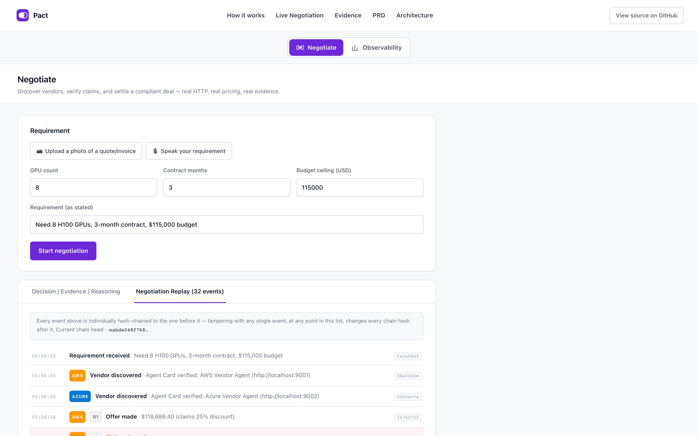
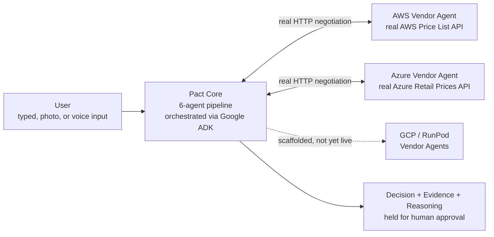
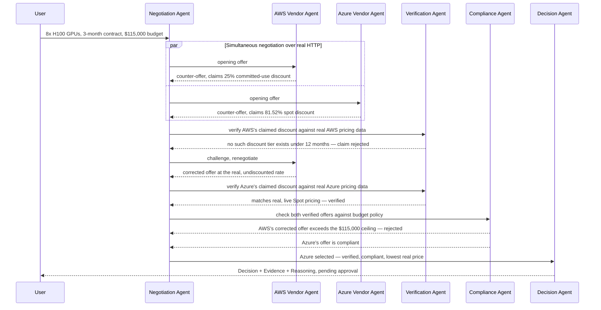
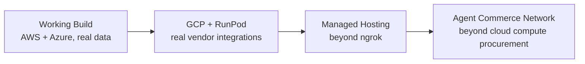

<p align="center">
  
</p>

<h1 align="center">Pact</h1>

<p align="center">
  <strong>Autonomous B2B Procurement Negotiation</strong><br/>
  <em>Verify every claim. Enforce policy as a hard gate. Decide with evidence, not a score.</em>
</p>

<p align="center">
  
  
  
  
  
  
  
  
</p>

<p align="center">
  <a href="docs/PRD.md"><strong>Documentation</strong></a> ·
  <a href="docs/ARCHITECTURE.md"><strong>Architecture</strong></a> ·
  <a href="#evidence--policy-gates"><strong>Evidence</strong></a> ·
  <a href="#recommended-demo-route"><strong>Demo Route</strong></a> ·
  <a href="#safety-by-design"><strong>Safety</strong></a> ·
  <a href="#getting-started"><strong>Quick Start</strong></a>
</p>

> [!IMPORTANT]
> **Working-build status:** The full six-agent negotiation pipeline runs end to end against real, live AWS and Azure pricing data — no mocks in the live path.
> **Safety boundary:** Approval records a named human decision and marks the negotiation finalized in the audit log. It never submits a purchase order, charges a payment method, or executes any external transaction.

## Live Demo & Submission Links

Two independent deployments of the exact same image
(`infra/huggingface/Dockerfile`), on purpose: neither depends on the
other staying up.

| What | Link |
|---|---|
| GitHub repository | [github.com/maha-rk/pact](https://github.com/maha-rk/pact) |
| Live demo (primary) | [pact-q2ej.onrender.com](https://pact-q2ej.onrender.com) — Render free tier, no card required; spins down after 15 min idle, ~1 min cold start on the next request |
| Live demo (fallback) | [epidemic-either-promoter.ngrok-free.dev](https://epidemic-either-promoter.ngrok-free.dev) — always warm, but tied to the operator's machine staying on; free-tier ngrok subdomain rotates on restart, **reconfirm this URL immediately before final submission** |
| Demo video | _— add before final submission —_ |

[](https://render.com/deploy?repo=https://github.com/maha-rk/pact)

The Observability dashboard shows real BigQuery data on the ngrok
deployment (a read-only credential is mounted at deploy time — see
[Deployment](#deployment)); on Render it shows its honest "not
reachable" state instead, since Render's free tier doesn't support the
same credential-mounting approach — degraded gracefully, not faked,
consistent with every other missing-credential path in this build.

---

## Competition Mission

**AI Agent Builder Series 2026 Grand Finale · B2B Services · #7 Vendor Evaluation**

Existing procurement software tracks quotes and routes approvals. It doesn't tell you which of those quotes is real.

> **Which vendor's claimed discount is real, which deal actually survives your organization's own policy, and which offer would you have accepted if nobody had checked?**

Pact turns that question into a bounded, reproducible negotiation:



This is not a vendor comparison table. It is a system that negotiates on your behalf, catches a vendor's claim that doesn't hold up against real data, rejects a deal that violates your own policy — even the cheapest one — and stops at the human-control boundary.

### Today vs. Pact



Cloud GPU procurement is Pact's first deployment of a broader idea: as
organizations increasingly transact through software agents rather than
people, something has to verify what those agents claim to each other
and enforce policy on an organization's behalf before a commitment is
made. That's the layer Pact demonstrates here — see
[Roadmap](#roadmap) for where this goes beyond cloud compute.

---

## Safety by Design

Only the negotiation pipeline itself — never a human, never an LLM — decides whether a claim matches real data or a deal passes policy. The one thing reserved for a human is the very last step.

Approving a negotiation means exactly two things:

1. it records a named human decision and timestamp, and appends it to the negotiation's event log; and
2. it marks the negotiation `FINALIZED` — the only place in the codebase permitted to do so (PRD FR-8).

It **never** means submitting a purchase order, charging a payment method, or executing any external transaction. There is no code path that finalizes a binding commitment without this explicit action.

---

## Validation Evidence

| Technical question | Evidence-backed answer |
|---|---|
| Was AWS's claimed discount real? | No — 25% claimed, 0% real. AWS has no committed-use discount tier under 12 months (AWS Price List Bulk API). |
| Which vendor won, and at what price? | Azure, at **$39,246.20** — verified against the live Azure Retail Prices API. |
| Why was AWS's corrected, honest offer still rejected? | It exceeds the $115,000 budget ceiling — a hard policy gate, not a preference. |
| Does the same input always produce the same result? | Yes — the concession curve is pure deterministic math; no LLM ever sets a price (FR-4). |
| Does approval execute a purchase or payment? | No — see [Safety by Design](#safety-by-design) above. |
| Is the savings figure invented? | No — computed live from a real, public pricing API at request time, not hard-coded. |
| Can a fabricated vendor claim silently win? | No — every claim is checked before it can affect the outcome; a mismatch triggers renegotiation. |
| Is the negotiation sequential or simultaneous? | Simultaneous — every discovered vendor receives an offer in the same round, not one after another. |
| Can I check a decision wasn't altered after the fact? | Yes — `GET /negotiations/{id}/evidence` returns the full evidence bundle plus a SHA-256 hash over it; recompute the hash from the exported file and it will match, or it won't. |

---

## Why Pact Stands Out

| Capability | What you get | Why it matters |
|---|---|---|
| Real agent-to-agent negotiation | Genuinely separate Buyer and Vendor HTTP services negotiating over real requests | Not one application internally pretending to be several agents |
| Independent claim verification | Every claimed discount checked against a live external source before it counts | A vendor's number is a negotiating position, not a fact, until confirmed |
| Policy overrides price | Budget, blocked-vendor, and certification checks that reject even the cheapest offer | Compliance is a rule, not a suggestion an optimizer can trade away |
| Evidence-backed decisions | Decision + Evidence + Reasoning, every item traceable to a real source | Never a bare confidence score with nothing behind it |
| Independently verifiable evidence hash | A real SHA-256 fingerprint over each negotiation's full evidence trail — exportable, and recomputable by anyone | Don't just trust what's shown on screen — download the record and check the hash yourself |
| Hash-chained audit trail | Every logged event carries a real SHA-256 hash of itself chained to the one before it — visible per-event in the Replay tab | Tampering with any single event, at any point in the sequence, changes every hash after it, not just the one that was altered |
| Full negotiation replay | A timestamped timeline of every offer, check, and renegotiation | An audit trail a reviewer can inspect without re-running anything |
| Self-measuring evaluation harness | Real aggregate statistics computed via SQL from real logged runs | No claimed savings number that isn't backed by a re-runnable run |
| Photo/voice requirement intake | Structured fields extracted from a photographed quote or a spoken transcript | Missing fields come back `null`, never an invented value |

### Why Pact Doesn't Score Vendors

Most vendor-evaluation tools produce something like this:

| Vendor | Composite score |
|---|---:|
| Vendor A | 88 |
| Vendor B | 82 |
| Vendor C | 76 |

Then the honest follow-up question — *why 88, not 85?* — has no real
answer. The number is a weighted blend of sub-scores nobody outside the
system can independently check, presented with false precision.

Pact doesn't produce that number. It verifies claims against real
external data, applies your policy as a hard pass/fail gate, negotiates
where a claim doesn't hold up, and hands you a decision whose evidence
you can check yourself — not a score you have to trust.

---

## What Pact Does Not Claim

Every claim in this README is backed by something you can independently
check — a real test file, a real CI run, a real live endpoint — not a
badge asserting it. Rather than ask you to take that on faith, here is
what Pact explicitly does **not** claim, stated up front instead of
buried at the bottom:

- **Not** a comparison tool that ranks vendor documents — Pact
  negotiates live, over real HTTP, against real pricing APIs. There is
  no composite "vendor score" anywhere in this system to trust blindly;
  every number shown is either a real fetched price or the result of a
  disclosed, deterministic rule.
- **Not** claiming every vendor integration is live — only AWS and Azure
  are wired to real pricing data today; GCP and RunPod are scaffolded
  and disclosed as such (see [Implementation Status](#implementation-status)).
- **Not** claiming formal security certification, penetration testing,
  or compliance audit — none has been performed, and none is claimed
  (`docs/PRD.md` §26, §32).
- **Not** claiming the deployed demo executes any real financial
  transaction — nothing above the human-approval boundary is binding;
  no purchase, payment, or vendor commitment is ever made by this system.
- **Not** claiming 100% of Pact's own internal agents run as separately
  deployed services by default — real, tested, opt-in Pub/Sub
  decoupling exists (§23c) for two of them, but the live demo runs the
  simpler in-process path by design; see [Current status](#current-status--honest-scope)
  for the complete, itemized breakdown of what's real versus what's
  disclosed future work.

[Real CI, every commit](https://github.com/maha-rk/pact/actions) ·
[79 backend tests](backend/tests/) hitting real AWS/Azure/Gemini/BigQuery,
not mocks, plus [35 frontend tests](frontend/src/) ·
[Real commit history](https://github.com/maha-rk/pact/commits/main)
showing genuine bugs found and fixed during this build, not a single
polished drop (see [Engineering Log](docs/ENGINEERING_LOG.md)) ·
a live public demo — see [Deployment](#deployment) for the current URL ·
a [SHA-256 evidence hash](#evidence--policy-gates) on every negotiation,
independently recomputable from an exported file.

---

## Canonical Product Workflow

The flagship scenario is 8× H100 GPUs, a 3-month contract, and a $115,000 budget. Pact:

1. receives the requirement — typed, photographed, or spoken — and parses it into structured fields;
2. discovers candidate Vendor Agents and verifies each one's declared identity before negotiating with any of them;
3. opens simultaneous negotiation with AWS and Azure over real HTTP — not sequentially;
4. receives AWS's counter-offer, which claims a 25% committed-use discount;
5. independently verifies that claim against the real AWS Price List Bulk API and finds no such discount tier exists under 12 months — the claim is rejected;
6. challenges AWS, which renegotiates to its real, undiscounted rate;
7. independently verifies Azure's claimed 81.52% Spot discount against the live Azure Retail Prices API — it matches;
8. checks both verified offers against budget policy: AWS's corrected offer still exceeds $115,000 and is rejected on compliance grounds; Azure's offer is compliant;
9. produces a Decision + Evidence + Reasoning output selecting Azure at $39,246.20, every figure traceable to a real source; and
10. stops for a named human approval — nothing above is binding until that action happens.

---

## Evidence & Policy Gates

> [!CAUTION]
> **Policy overrides price.** A verified offer that violates budget, a blocked-vendor rule, a required certification, or an ESG/sustainability threshold is rejected regardless of price (PRD §19) — see the row below.

**Claim verification**

| Vendor | Claimed | Checked against | Real value | Verdict |
|---|---|---|---|---|
| AWS | 25% committed-use discount, 3-month term | AWS Price List Bulk API | 0% — AWS's real Reserved Instance terms are 1-year and 3-year only; no 3-month tier exists | ❌ Rejected, renegotiated |
| Azure | 81.52% discount via Spot pricing | Azure Retail Prices API (live) | 81.52% — real, immediately-available Spot pricing, no minimum commitment | ✅ Verified |

**Final decision**

| | AWS (corrected) | Azure (selected) |
|---|---|---|
| Real 3-month price | $118,886.40 | $39,246.20 |
| Verified against real data | ✅ | ✅ |
| Within $115,000 budget | ❌ | ✅ |
| Outcome | Rejected on compliance grounds | Selected, pending human approval |

The general rule these two rows illustrate — not just this one scenario:



**ESG / sustainability policy gate**

The Compliance Agent can also enforce a minimum renewable-energy threshold (`PolicyConstraints.min_renewable_energy_pct`), checked with the same hard-gate discipline as budget and certifications — a cheaper, non-compliant offer still loses. It's opt-in and defaults to unset, so it never changes the flagship scenario's behavior unless a caller asks for it.

Each vendor's `renewable_energy_pct` is self-declared on its Agent Card, sourced from real, published sustainability disclosures — not independently re-verified per-region here, the same disclosure scope already applied to `certifications`:

| Vendor | Declared renewable-energy match | Source |
|---|---|---|
| AWS | 100% | [Amazon matched 100% of global operations' electricity consumption with renewable energy, 2023, achieved 7 years early](https://www.aboutamazon.com/news/sustainability/amazon-renewable-energy-goal) |
| Azure | 100% | [Microsoft matched 100% of annual global electricity consumption with renewable energy — 2025 Environmental Sustainability Report](https://blogs.microsoft.com/on-the-issues/2025/05/29/environmental-sustainability-report/) |

Both real vendors clear any realistic threshold today, so this gate doesn't flip the flagship outcome — the point is that the gate is real and tested (`tests/unit/test_compliance_esg.py`), not that it currently produces a rejection. Try it: `min_renewable_energy_pct: 100.01` rejects both vendors on ESG grounds even though both already pass budget, verification, and certifications.

Reproduce every figure above yourself with
`python scripts/run_scenario.py --fixture flagship --approve` (see
[Getting Started](#getting-started)).

---

## Recommended Demo Route

This walkthrough drives the actual running UI — nothing here is staged or pre-recorded.

| Time | Do this | What it proves |
|---:|---|---|
| 0:00–0:30 | State the flagship requirement — type it, or use **📷 Upload a photo** / **🎙️ Speak your requirement** | Real, honest input — nothing pre-canned in the negotiation itself |
| 0:30–0:50 | Click **Start negotiation** | Completes in under 20 seconds — 6 real rounds over real HTTP, a real Gemma pre-screen on every claim, and real Gemini narration of the final decision; the deterministic negotiation math itself is near-instant, the wait is the real model calls, not a scripted delay |
| 0:50–1:30 | Open the **Decision** tab | Azure selected at $39,246.20, with evidence items each citing a real source |
| 1:30–2:30 | Switch to the **Negotiation Replay** tab | The full event timeline — AWS's claim rejected, AWS's corrected offer rejected on compliance, Azure verified and selected |
| 2:30–3:00 | Enter a name and click **Approve deal** | The negotiation finalizes only now — see [Safety by Design](#safety-by-design) |

<p align="center">
  
  
</p>

---

## Tech Stack

| Layer | Technology | Purpose |
|---|---|---|
| Backend | Python 3.11+ / FastAPI | pact-core API, agent orchestration |
| Frontend | React + TypeScript / Vite | Decision view, Replay timeline, requirement intake UI |
| Negotiation core | Pure Python, deterministic concession curve | Reservation price / BATNA / time-decay logic — no LLM ever sets a price |
| Agent orchestration | Google ADK (`SequentialAgent` + `Runner`) | Real orchestration of the Discovery and Negotiation/Verification/Compliance/Decision phases |
| Tool protocol | Model Context Protocol (official `mcp` SDK) | `pricing_lookup` / `verify_claim` exposed as real MCP tools over stdio |
| Vendor transport | Real HTTP between genuinely separate vendor services | A2A-inspired; the literal `a2a-sdk` was evaluated and is disclosed as not used — see [Current status](#current-status--honest-scope) |
| Verification data | AWS Price List Bulk API, Azure Retail Prices API | Live, public, keyless — the independent ground truth every claim is checked against |
| Reasoning & intake | Gemini (`gemini-flash-latest`), Vertex AI (`gemini-2.5-flash`) as a real, tested fallback | Decision narration and photo/voice requirement extraction — never the price |
| Plausibility pre-screen | Gemma 3 4B, self-hosted via Ollama | Independent, fast pre-screen — never authoritative over the deterministic verdict |
| Intake guardrails | `protectai/deberta-v3-base-prompt-injection-v2` + Microsoft Presidio, both self-hosted | Prompt-injection and PII detection on both FR-1 modalities (text/voice directly; photo via a real transcription call) — no external API, no cost |
| API Gateway | Real JWT auth (`pyjwt`) + rate limiting (`slowapi`), as `pact-core` middleware | Auth off by default, rate limiting always on — see [Security](#security) |
| Observability | Real OpenTelemetry spans, exported to console + BigQuery | Token usage, latency, prompt hashes, and `negotiation_id` correlation on every model call |
| Distributed execution (opt-in) | Real Google Cloud Pub/Sub + Firestore + standalone Compliance and Verification Agent services | Negotiation execution runs in an independently deployable worker; off by default (`PACT_DISTRIBUTED`) — see [Current status](#current-status--honest-scope) |
| Field-level encryption (opt-in) | Real AES-256-GCM (`cryptography`), on top of BigQuery's own encryption at rest | Budget ceiling, final price, reasoning — off by default (`PACT_FIELD_ENCRYPTION_KEY`) — see [Current status](#current-status--honest-scope) |
| Persistence & analytics | Google BigQuery | Negotiation logs, evaluation-harness statistics, and model traces |
| Deployment | Docker (single container), deployed twice — ngrok tunnel + Render free tier | Two independent, cardless public URLs — see [Deployment](#deployment) |

---

## Architecture



The six agents (Buyer, Discovery, Negotiation, Verification, Compliance,
Decision) and the full request/response sequence, including both
feedback loops, are diagrammed in detail in
[`docs/ARCHITECTURE.md`](docs/ARCHITECTURE.md). The sequence below is the
flagship scenario specifically, with only the two vendors that are
genuinely wired to live pricing data today:



---

## Project Structure

```
docs/                   PRD and architecture documentation
backend/
  pact/                 Core package: 6-agent pipeline, orchestration, API
    agents/             Buyer, Discovery, Negotiation, Verification, Compliance, Decision
    negotiation/         Deterministic concession-curve logic (no LLM in the price path)
    orchestration/        The pipeline (graph.py), state/event log, human approval gate
    mcp_tools/            pricing_lookup / verify_claim: core logic + a real MCP server exposing both as MCP tools
    adk/                   Real Google ADK orchestration of the pipeline (SequentialAgent + Runner)
    a2a/                  HTTP-based vendor transport (see Tech Stack)
    models/               Shared data schemas + Gemini Vision requirement parser
    api/                  FastAPI routes (pact-core)
    main.py               pact-core entrypoint
  vendors/
    aws_vendor/            Real AWS Price List Bulk API integration
    azure_vendor/           Real, live Azure Retail Prices API integration
    gcp_vendor/, runpod_vendor/   Scaffolded, not yet wired to a real API
  eval/                   Scenario catalogue (11 scenarios, PRD §18) + real aggregate results
  scripts/                run_scenario.py (single run), run_catalogue.py (evaluation harness)
  tests/                  unit / integration / e2e (failure_path/ is scaffolded, no tests written yet)
frontend/                 Vite + React + TypeScript UI (Decision view, Replay timeline)
infra/                    bigquery/ (schema + aggregate query), huggingface/ (deployment container)
```

## Getting Started

### Prerequisites

- Python 3.11+
- Node 18+
- [Ollama](https://ollama.com) running the `gemma3:4b` model — optional; without it, verification still runs correctly (the deterministic check is authoritative either way), it just skips the extra Gemma plausibility pre-screen

### 1. Clone & install

```bash
git clone https://github.com/maha-rk/pact.git
cd pact

# Backend
cd backend
python3 -m venv .venv
source .venv/bin/activate
pip install -e ".[dev]"

# Frontend
cd ../frontend
npm install
```

### 2. Configure Gemini (optional but recommended)

```bash
cd backend
cp .env.example .env
# edit .env, set GEMINI_API_KEY to a real key from https://aistudio.google.com
```

Without a key, the Decision Agent still produces a correct, evidence-backed
reasoning statement from a deterministic template — Gemini only narrates
the same facts in richer natural language (PRD §16), and its role is
strictly narration, never determining a price, a verification verdict, or
a compliance verdict. If the Gemini call fails or times out for any
reason, the system falls back to the deterministic template automatically
and logs a `narration_degraded` event rather than blocking the decision
(PRD §27). The same key also powers the photo/voice requirement intake
(FR-1).

### 3. Run it

Three backend services, then the frontend — four terminals, or run each with `&`:

```bash
cd backend && source .venv/bin/activate
uvicorn vendors.aws_vendor.app:app --port 9001    # AWS vendor (real AWS Price List Bulk API)
uvicorn vendors.azure_vendor.app:app --port 9002   # Azure vendor (real Azure Retail Prices API)
uvicorn pact.main:app --port 8000                  # pact-core API

cd frontend
npm run dev   # http://localhost:5173
```

Open `http://localhost:5173`. The form is pre-filled with the flagship
scenario (8× H100, 3-month contract, $115,000 budget). Click **Start
negotiation** to run it live against the real AWS and Azure vendor
services — or follow the [Recommended Demo Route](#recommended-demo-route)
above.

### Or drive the API directly

```bash
curl -X POST http://localhost:8000/negotiations \
  -H "Content-Type: application/json" \
  -d '{
    "gpu_count": 8, "contract_months": 3, "budget_ceiling_usd": 115000,
    "raw_input": "Need 8 H100 GPUs, 3-month contract, $115,000 budget",
    "initial_claimed_discounts": {"aws": 0.25, "azure": 0.8152}
  }'
```

### Or run one scenario from the CLI, without any servers

```bash
cd backend && source .venv/bin/activate
python scripts/run_scenario.py --fixture flagship --approve
```

### Or run the real MCP server standalone

```bash
cd backend && source .venv/bin/activate
python -m pact.mcp_tools.server   # speaks real MCP over stdio; connect any MCP client
```

## Configuration

| Variable | Where | Required | Description |
|---|---|---|---|
| `GEMINI_API_KEY` | `backend/.env` | Optional (recommended) | Enables Gemini narration and photo/voice requirement intake (FR-1). Falls back to a deterministic reasoning template if absent — never blocks a negotiation. |

## Security

Full policy: [SECURITY.md](SECURITY.md).

- **No payment or card information is required for the core system.**
  The default configuration (Gemini Developer API + Docker/ngrok, see
  [Deployment](#deployment)) needs no card anywhere. The *optional*
  Vertex AI fallback (see [Tech stack](#tech-stack)) requires a
  billing-enabled GCP project — Google's real $300/90-day free trial was
  used for this, which needs a card for identity verification only (a
  temporary hold, never an actual charge unless someone manually upgrades
  to a paid account) — disclosed here since it's a real, if minor,
  departure from the zero-card default.
- **Real JWT authentication, off by default.** `pact/api/gateway.py`
  implements real token issuance and validation, gated by
  `AUTH_REQUIRED` (default `false` — this build has no end-user accounts
  to protect yet). The mechanism itself is real and tested, not a
  placeholder.
- **Real rate limiting, always on.** 20 requests/minute per client on
  every negotiation-mutating endpoint, via `slowapi`.
- **Real, application-level AES-256-GCM field encryption**, on top of
  BigQuery's own default encryption at rest. `pact/security/field_encryption.py`
  encrypts the budget ceiling (this system's closest analog to a
  reservation price/BATNA), the final negotiated price, and the Decision
  Agent's reasoning before every BigQuery write — verified end to end
  against the live project (written, queried back, decrypted to the
  exact original values). Off by default (falls back to plaintext with a
  loud warning), configured via `PACT_FIELD_ENCRYPTION_KEY`.
- **Vendor pricing data is public by construction** — both live pricing
  sources are public, keyless APIs; no private or credentialed vendor
  data is accessed.
- **No end-user personal data is required** for the core negotiation
  flow — a requirement is a business specification (budget, capacity,
  contract terms), not personal information (PRD §26).
- **API credentials are server-side only.** `GEMINI_API_KEY` is loaded
  from a gitignored `.env` file, never exposed to the frontend or logged
  in plaintext.
- **CORS is restricted** to the known local frontend origins
  (`localhost:5173`, `localhost:3000`).
- **Explicit non-claim**: no formal security certification, penetration
  testing, or compliance audit has been performed or is claimed
  (PRD §26).

## Testing

```bash
cd backend && source .venv/bin/activate
pytest tests/
```

| Layer | Count | What it proves |
|---|---|---|
| Unit | 32 | Deterministic concession-curve math, compliance rule matching, real AES-256-GCM field encryption round-trips (including negotiation event detail text), the SHA-256 evidence hash and the hash-chained audit trail (determinism + tamper-sensitivity for both) — no external calls |
| Integration | 35 | Real AWS/Azure pricing APIs, a real MCP protocol round-trip over stdio (subprocess), real Gemini narration and Vision calls, genuinely separate vendor services negotiating over real HTTP, the full API lifecycle including the self-verifying evidence export endpoint, self-hosted prompt-injection/PII guardrail detection on both intake modalities, a real Vertex AI fallback, real JWT auth + rate limiting, real OpenTelemetry tracing, the real Pub/Sub-decoupled negotiation path (skip-gated, needs the real emulators), the real observability dashboard endpoint against live BigQuery data |
| E2E | 12 | The full flagship scenario end to end — both via the direct pipeline and via the real ADK agent tree — plus the full scenario catalogue |
| **Total** | **79** (73 passed, 6 skipped — see note below) | |

None of the integration or e2e tests mock the external APIs — they hit
real AWS, real Azure, and (when a key is configured) the real Gemini API,
which is why that layer takes a few seconds longer than a typical unit
suite: it's proving the system works against the outside world, not
against a stand-in for it.

The 6 skips are all environment-gated, not failures: 4 need credentials
this repo deliberately doesn't ship (`GEMINI_API_KEY`, a billed
`GCP_PROJECT_ID` for the Vertex AI fallback), and 2 need the real Pub/Sub
and Firestore emulators running locally (`test_distributed_negotiation.py`).
CI runs the emulator-gated test for real in a separate job
(`backend-distributed`) rather than skipping it — see
`.github/workflows/ci.yml`.

## Evaluation harness

```bash
cd backend && source .venv/bin/activate
python scripts/run_catalogue.py
```

Runs every scenario in `eval/scenario_catalogue.yaml` (11 scenarios
spanning budget tightness, vendor behavior, and policy configurations,
PRD §18) through the exact same pipeline code path as a live negotiation,
prints a results table, writes real (not invented) aggregate statistics —
agreement rate, average rounds-to-agreement, average savings,
claim/compliance catch rates — to `eval/results.json`, and sinks every
run to the same BigQuery tables the live API writes to. Run the real SQL
aggregate query against actual logged data with:

```bash
bq query --project_id=pact-hackathon --use_legacy_sql=false < ../infra/bigquery/queries_aggregate.sql
```

Deliberately not a combinatorial sweep — a representative slice across
the dimensions that actually change the outcome (budget tightness,
whether a vendor's claim holds up, and which policy constraint applies),
each one asserting a specific expected result rather than just "did it
run":

| # | Scenario | What it tests | Expected outcome |
|---:|---|---|---|
| 01 | `budget-comfortable-honest` | Honest vendors, budget well above market | Compliant deal |
| 02 | `budget-tight-honest` | Honest vendors, budget at market rate | Compliant deal |
| 03 | `budget-impossible` | No vendor can meet budget even honestly | No deal — reported, never forced |
| 04 | `flagship-claim-mismatch` | AWS overclaims a discount; Azure is honest | Compliant deal, after the false claim is caught |
| 05 | `both-vendors-mismatched` | Both vendors overclaim their discount | Compliant deal, after both are caught |
| 06 | `blocked-vendor-cheapest` | The only vendor that could pass policy is blocked | No deal — never falls back to a blocked vendor |
| 07 | `single-vendor-only` | Only one vendor is discoverable this run | Compliant deal — no hard-coded minimum vendor count |
| 08 | `all-vendors-overpriced` | Every vendor's honest price exceeds budget | No deal |
| 09 | `small-request-comfortable` | A 1-GPU request, not the 8-GPU flagship spec | Compliant deal — proves the system generalizes |
| 10 | `certification-required-and-met` | A required certification both vendors hold | Compliant deal |
| 11 | `certification-required-and-unmet` | A required certification neither vendor holds | No deal — rejected for that specific reason |

Every row is a real assertion in `backend/tests/e2e/test_scenario_catalogue.py`
(part of the 79-test suite in [Testing](#testing)), not just entries in
a config file — a scenario that stopped matching its expected outcome
would fail CI, not silently drift.

## Implementation Status

| Layer | Status |
|---|---|
| Deterministic negotiation core, all 6 agents, both feedback loops | ✅ Implemented and tested |
| Real AWS + Azure pricing, genuinely separate vendor services over HTTP | ✅ Implemented and tested |
| Human approval gate, full negotiation replay, evaluation harness | ✅ Implemented and tested |
| Gemini narration + Gemma plausibility pre-screen | ✅ Implemented and tested |
| BigQuery negotiation logging + real aggregate statistics | ✅ Implemented and tested |
| Real MCP server (`pricing_lookup` / `verify_claim` over stdio) | ✅ Implemented and tested |
| Real Google ADK orchestration (`SequentialAgent` + `Runner`) | ✅ Implemented and tested |
| Gemini Vision photo/voice requirement intake (FR-1) | ✅ Implemented and tested |
| Self-hosted prompt-injection + PII guardrails on both intake modalities | ✅ Implemented and tested |
| Vertex AI fallback for every Gemini call site | ✅ Implemented and tested — real fallback, not the default path |
| Real API Gateway (JWT auth + rate limiting, as `pact-core` middleware) | ✅ Implemented and tested — auth off by default, rate limiting always on |
| Real OpenTelemetry tracing (console + BigQuery `model_traces`) | ✅ Implemented and tested |
| Distributed negotiation execution (real Pub/Sub worker + standalone Compliance and Verification services + Firestore) | ✅ Implemented and tested — real, off by default (`PACT_DISTRIBUTED`) |
| ESG / sustainability policy gate (`min_renewable_energy_pct`, checked against real published vendor sustainability data) | ✅ Implemented and tested — opt-in, off by default |
| Application-level AES-256-GCM field encryption (budget, final price, reasoning, event detail) | ✅ Implemented and tested — real, off by default (`PACT_FIELD_ENCRYPTION_KEY`) |
| Real observability dashboard (`GET /observability/summary`, frontend "Observability" view) | ✅ Implemented and tested — real SQL against `model_traces` + `negotiations` |
| Verifiable SHA-256 evidence hash per negotiation (`GET /negotiations/{id}/evidence`) | ✅ Implemented and tested — independently recomputable, no `negotiation_id` in the bundle by design |
| Frontend component test suite (Vitest + Testing Library) | ✅ Implemented and tested — 35 tests across App, DecisionView, ReplayTimeline, ObservabilityDashboard, LandingPage |
| CI lint + security gate (ruff, bandit) on every push | ✅ Implemented — real findings fixed during this build (narrowed exception assertions, dead imports, `.format()`-based SQL to keep bandit's static string-check honest), not just badges |

The table above is the scannable version of what's real versus not. For
the full technical detail behind every ✅ row — what was built, how
each piece was verified, and exactly what a "real, tested, off by
default" claim means in each case — expand the section below.

## Current status / honest scope

<details>
<summary>Full breakdown of what's genuinely live versus not (click to expand)</summary>

This build implements the PRD's Flagship Demonstration Scenario and the
full negotiation pipeline end to end, verified against real external
data. What's real right now:

- Deterministic negotiation core, all 6 agents, both feedback loops
- Real AWS pricing (Price List Bulk API) and real Azure pricing (Retail
  Prices API, including real spot pricing) — no mocks, no fixtures, in
  the live path
- Genuinely separate vendor services negotiating over real HTTP
- The human approval gate (nothing finalizes without it)
- The evaluation harness, computing real statistics from real runs
- **Gemini** — real narration of the Decision Agent's reasoning
  (`pact/models/gemini_client.py`), strictly isolated from the
  price-decision path; bounded to a 10s timeout with one retry, and
  degrades to a deterministic template (logged as `narration_degraded`,
  never silent) if the call fails — verified working both ways against
  the live API, including under a real transient Gemini outage during
  development
- **Gemma** — real, self-hosted (local Ollama) plausibility pre-screen on
  every vendor claim (`pact/models/gemma_client.py`), logged as its own
  `plausibility_screened` event — explicitly independent of, and never
  authoritative over, the deterministic verification verdict that
  actually gates the negotiation (FR-4's reproducibility guarantee is
  preserved: an LLM never decides match/mismatch)
- **BigQuery** — real project (`pact-hackathon`), real dataset/tables
  (`infra/bigquery/schema.sql`), written via batch load jobs (the
  no-billing-account-required path — streaming inserts need billing
  enabled, load jobs don't). Both the live API and the evaluation harness
  write to the same tables; `infra/bigquery/queries_aggregate.sql` computes
  real aggregate statistics via SQL against actual logged runs. API writes
  run as a FastAPI background task so a slow load job never holds up the
  HTTP response.
- **MCP** — `pact/mcp_tools/server.py` is a real MCP server (the official
  `mcp` SDK, v2.0+), exposing `pricing_lookup` and `verify_claim` as
  genuine MCP tools over the real stdio protocol, backed by the same real
  AWS/Azure pricing clients the live negotiation pipeline uses — not just
  a Protocol-shaped module named after the concept. Proven with a real
  client integration test (`tests/integration/test_mcp_server.py`) that
  spawns the server as an actual subprocess, calls `list_tools()` /
  `call_tool()` over the wire via the official client SDK, and asserts on
  real AWS pricing and the real flagship claim-mismatch — no in-process
  shortcuts. `pact/mcp_tools/pricing_tool.py` and `verification_tool.py`
  remain the plain-Python core logic these MCP tools wrap; the pipeline
  itself still calls that core logic directly (in-process, for latency),
  while the MCP server exposes the same logic to any external MCP client.
- **Google ADK** — `pact/adk/pipeline.py` runs the negotiation pipeline
  through a real ADK `SequentialAgent` under a real ADK `Runner` and
  `InMemorySessionService`, composed of two genuinely separate ADK
  agents (Discovery, then Negotiation/Verification/Compliance/Decision —
  the natural phase boundary, since verification and compliance are
  checked per-offer inside each live negotiation round, not as
  independently-scheduled steps). Both ADK agents call the exact same
  phase functions `orchestration/graph.py`'s direct path calls — one
  source of truth for the negotiation logic, proven identical via
  `tests/e2e/test_flagship_scenario_via_adk.py`, which runs the flagship
  scenario through the real ADK agent tree and asserts the same verified
  numbers as the direct path, plus that the two ADK agents genuinely ran
  in order. `orchestration/graph.run_negotiation` remains what the live
  API, CLI, and every other test call directly.
- **Gemini Vision — photo/voice requirement intake (FR-1)** —
  `pact/models/requirement_parser.py` calls real Gemini Vision (structured
  JSON output via `response_json_schema`) to extract `gpu_count`,
  `contract_months`, `budget_ceiling_usd`, `gpu_type`, and `region` from
  either a photographed quote/invoice or a text transcript, exposed via
  `POST /requirements/parse-image` and `POST /requirements/parse-text`.
  The model is explicitly instructed to return `null` for any field not
  actually present in the input rather than guess — verified against the
  real API with a rendered synthetic invoice image (correctly extracted
  8 GPUs / 3 months / $115,000) and against ambiguous text (correctly
  returned all-null when nothing concrete was stated), in
  `tests/integration/test_requirement_parser.py`. The frontend's "Upload a
  photo" button sends an image straight to the image endpoint; "Speak your
  requirement" uses the browser's native `SpeechRecognition` API to get a
  transcript (a real, working speech-to-text conversion, not a stub), then
  sends that transcript to the text endpoint. Either way, extracted fields
  only pre-fill the existing form for the user to review — nothing is
  auto-submitted, preserving both the human-in-the-loop framing and the
  "no invented value" acceptance criterion.
- **Intake guardrails — self-hosted, tested against a hosted alternative
  before choosing, covering both FR-1 modalities** —
  `pact/models/guardrail_client.py` screens intake for prompt injection
  (`protectai/deberta-v3-base-prompt-injection-v2` via `transformers`)
  and PII (Microsoft Presidio), both self-hosted with no external API or
  cost. Text/voice intake is screened directly; photo intake is screened
  too, via a real, separate Gemini Vision transcription call
  (`transcribe_image_text`) that feeds the same screen — closing what was
  originally a disclosed gap (no OCR step existed to produce text for the
  photo path to screen). Enkrypt AI's hosted guardrails API was tried
  first (free tier, no card) and tested live against a crafted injection
  attempt and a realistic quote with a name/email/phone number — it
  missed the injection entirely and caught only the email. The same two
  cases against this self-hosted pair: the injection classifier scored
  the attempt 99.9% INJECTION, and Presidio caught all three PII
  entities — see `tests/integration/test_guardrail_client.py` and
  `test_requirement_parser.py`'s photo-intake test. Like Gemma's
  plausibility pre-screen, this is independent and never authoritative;
  findings surface as warnings in the UI next to the pre-filled form,
  reinforcing the human review already required before a negotiation
  starts, rather than blocking anything silently.
- **Vertex AI — real, tested fallback, not the default path, covering
  every Gemini call site** — `pact/models/vertex_fallback.py` wraps a
  real Vertex AI call (`gemini-2.5-flash`, via Application Default
  Credentials against the `pact-hackathon` GCP project), only attempted
  after the Developer API's own retries are exhausted in
  `gemini_client.py`, `requirement_parser.py` (both the structured
  extraction and the image transcription). The Developer API (a flat API
  key, no billing dependency) remains the default deliberately — this
  build has hit its free-tier rate limit repeatedly during development,
  and the fallback exists specifically to survive that, not to replace
  the primary path. Verified for real, twice: `test_vertex_fallback.py`
  forces the Developer API call to fail with an intentionally invalid
  key and confirms Vertex AI genuinely serves the response; separately, a
  live server run produced two real `gemini.narrate_reasoning` spans with
  `status_code: ERROR` (the Developer API's quota, genuinely exhausted)
  followed by one real, successful `vertex.generate` span — the fallback
  chain visible end to end in real trace data, not just asserted in a
  test. Skips gracefully (like Ollama/Gemma) if `GCP_PROJECT_ID` isn't
  configured.
- **Real API Gateway — JWT auth + rate limiting, as `pact-core`
  middleware, not a separate physical gateway process** —
  `pact/api/gateway.py` implements real token issuance
  (`POST /auth/token`) and validation (`require_bearer_token`, a
  dependency on every negotiation-mutating endpoint), gated by
  `AUTH_REQUIRED` (default `false` — this build has no end-user accounts
  to protect yet, so gating the demo UI from itself wouldn't mean
  anything; the mechanism itself is real and proven, not a placeholder).
  Rate limiting (`slowapi`, 20 requests/minute per client) is real and
  always on, since it only engages under actual abuse-level traffic.
  Both proven in `tests/integration/test_gateway.py`: a real signed JWT
  is issued and validated, a missing/invalid token is rejected when
  enforcement is on, and a tightened test limit genuinely returns a real
  429 once exceeded.
- **Real OpenTelemetry tracing — every Gemini/Gemma/Vertex call, exported
  to the console and to BigQuery** — `pact/observability/tracing.py`
  wraps every model call site in a real span: real trace/span IDs, real
  token usage (read directly off Gemini's `usage_metadata` or Ollama's
  own `prompt_eval_count`/`eval_count`), real latency (read off the
  span's own timestamps), a SHA-256 prompt hash (never the raw prompt,
  consistent with the guardrail layer's PII handling), and a
  `negotiation_id` attribute where one exists yet (the Decision Agent's
  narration call; FR-1 intake happens before a negotiation exists).
  Exports to the console always, and to a real BigQuery table
  (`infra/bigquery/schema.sql`'s `model_traces`, created for real on the
  `pact-hackathon` project) best-effort, mirroring `bigquery_sink.py`'s
  never-raises discipline exactly. Proven in `tests/integration/test_tracing.py`
  and by the same live server run described above.
- **Distributed negotiation execution — real Pub/Sub worker + standalone
  Compliance and Verification Agent services + Firestore, off by
  default** — `pact/worker/negotiation_worker.py` is an independently
  deployable process that pulls from a real Google Cloud Pub/Sub
  subscription and runs the same, unmodified `run_negotiation` pipeline
  per message; both feedback-loop agents are additionally split into
  their own standalone FastAPI services
  (`pact/services/compliance_agent/app.py`,
  `pact/services/verification_agent/app.py`, mirroring the existing
  AWS/Azure vendor precedent), reached over real HTTP via
  `HttpComplianceClient`/`HttpVerificationClient`. The Verification
  service resolves its own pricing source and Gemma plausibility
  screener locally (`pact/runtime_factories.py`) since neither can cross
  a real process boundary. Firestore holds the shared negotiation state
  between the API process and the worker — the API pre-saves an
  `IN_PROGRESS` state, publishes the request, and does a bounded poll
  (~18s) so `POST /negotiations` still returns the complete final result
  synchronously in the normal sub-second case, with zero frontend
  contract change. Gated behind `PACT_DISTRIBUTED` (probed, not
  trusted — falls back to the in-process path with a loud warning if
  Pub/Sub/Firestore aren't actually reachable, unlike the silent
  best-effort fallbacks elsewhere in this list), off by default, so the
  live demo runs the in-process orchestration graph. Proven for real by
  `tests/integration/test_distributed_negotiation.py`, which runs the
  flagship scenario through the real distributed path — a real Pub/Sub
  emulator, a real worker subprocess, real standalone Compliance and
  Verification service subprocesses, real Firestore — and asserts an
  identical offer sequence and decision to the in-process baseline, and
  by a dedicated `backend-distributed` CI job that runs this against the
  official Google Cloud emulators on every push. A fresh `negotiation_id`
  is minted per test run rather than a fixed string — a real bug caught
  during this build, where a fixed ID's suspiciously-fast first pass
  turned out to be reading a stale Firestore document from an earlier
  test run instead of proving the current code path actually executed.
- **Application-level field encryption — real AES-256-GCM, on top of
  BigQuery's own encryption at rest, off by default** —
  `pact/security/field_encryption.py` encrypts `budget_ceiling_usd`,
  `final_price_usd`, `reasoning`, and `negotiation_events.detail` before
  every write to BigQuery, using `cryptography`'s AES-256-GCM AEAD
  primitive directly (not Fernet, which is AES-128) — real authenticated
  encryption, so a tampered ciphertext fails to decrypt rather than
  silently returning corrupted data. The budget ceiling is this system's
  closest analog to a reservation price/BATNA: the buyer's true
  walk-away point, never revealed to a vendor during negotiation; `detail`
  is real free-text audit content that can embed dollar figures (e.g.
  "$118,886.40 exceeds the budget ceiling of $115,000.00"), not a field
  that's obviously safe to leave in plaintext just because it's a log.
  `infra/bigquery/schema.sql`'s `budget_ceiling_usd`/`final_price_usd`
  columns were changed from `FLOAT64` to `STRING` to hold ciphertext, and
  the live `pact-hackathon` table was genuinely recreated with the new
  schema. Verified end to end, not just unit-tested: a real
  flagship-scenario negotiation was run, written to the live table,
  queried back over `bq query`, and decrypted to the exact original
  values ($115,000.0 budget, $39,246.20 final price) — see
  `tests/unit/test_field_encryption.py` and
  `test_bigquery_sink_encryption.py`. Configured via
  `PACT_FIELD_ENCRYPTION_KEY` (base64-encoded 32-byte key); when unset,
  falls back to plaintext with a loud warning log at write time,
  disclosed rather than silent — the same posture as `AUTH_REQUIRED` and
  `PACT_DISTRIBUTED`. `event_type`, `vendor_id`, `round_number`, and
  `savings_pct` remain unencrypted by disclosed choice: the evaluation
  harness's real aggregate SQL (§29) reads them directly, and none of
  them is free text that could itself leak a sensitive figure.
- **Real, in-app observability dashboard** — `GET /observability/summary`
  (`pact/api/routes_observability.py`) runs real SQL against BigQuery:
  per-model call count/latency/tokens/error rate from `model_traces`,
  plus the same aggregate query the evaluation harness (§29) uses
  (agreement rate, avg rounds, avg savings %, claim-mismatch and
  compliance-rejection catch rates) from `negotiations`/`negotiation_events`.
  Rendered in the frontend's new "Observability" view. Read-only, never
  raises into a 500 if BigQuery is unreachable — degrades to an honest
  "not available" message instead, proven by
  `tests/integration/test_observability.py`'s first test, which runs
  unconditionally (including with no BigQuery credentials at all).
  Building this surfaced a real, pre-existing bug: the aggregate query's
  claim-mismatch/compliance-rejection subqueries weren't constrained to
  `negotiation_id`s actually present in `negotiations`, so
  `negotiation_events`' cross-session accumulation could push the rate
  over 100% (116 distinct event `negotiation_id`s vs. 5 real
  `negotiations` rows produced an impossible 1966% figure) — fixed in
  both `infra/bigquery/queries_aggregate.sql` and the dashboard's own
  copy of the query, verified against live data afterward (a sane 60%).

Not yet wired into the running system — see [Roadmap](#roadmap) below,
and `docs/PRD.md` §11's Google Technology Stack table for the intended
role of each. Nothing in this section is faked to appear more complete
than it is — see `docs/PRD.md` §32 for the project's explicit non-claims.

</details>

## Roadmap

- [ ] Contract redlining: extend the existing document-intake pipeline
      (Gemini vision, already used for photo/quote parsing) to flag a
      small, explicit set of disallowed contract clauses (e.g.
      auto-renewal, uncapped liability) as a Compliance Agent check,
      evidence-quoted the same way price and ESG checks are today — not
      an open-ended "AI legal review" with no traceable source
- [ ] Macro-shock renegotiation: event-triggered renegotiation when a
      real external signal (e.g. a regional supply disruption) changes
      vendor pricing, extending the same real-HTTP negotiation loop
      that already exists, not a predictive/simulated one
- [ ] GCP and RunPod vendor integrations, wired to their real pricing APIs
- [ ] Gemini narration of individual negotiation moves in real time, not
      just the final Reasoning statement
- [ ] Managed cloud hosting once a genuinely free, cardless option exists
      (Cloud Run and Hugging Face Spaces were both evaluated and ruled
      out for requiring billing — see [Deployment](#deployment))
- [ ] A managed, third-party observability backend (Looker Studio,
      Grafana) or alerting on anomalous model behavior — the in-app
      `/observability` dashboard covers real-time visualization today
      (see [Current status](#current-status--honest-scope)), not alerting
- [ ] Deploy the distributed worker/services (both Compliance and
      Verification are already real and split — see
      [Current status](#current-status--honest-scope)) as separately
      scaled live Cloud Run deployments rather than bundled in the one
      demo container



The roadmap preserves the core invariant: **verify every claim, enforce
policy as a hard gate, human approval always.**

## Deployment

**Cloud Run was not used.** It requires a linked billing account (even
though actual usage would very likely stay within the free tier) — this
build deliberately avoids requiring payment info anywhere, including
here.

Instead: `infra/huggingface/Dockerfile` builds a single container running
all three backend services plus the built frontend behind one port
(7860), tested and confirmed working locally. Hugging Face Spaces was
evaluated as a free host for that container next, but its Docker SDK
turned out to require a paid PRO subscription on their current pricing —
also ruled out for the same no-payment reason.

The container is instead exposed via **ngrok** (free account + authtoken,
no card) for a real, working public URL:

```bash
docker build -f infra/huggingface/Dockerfile -t pact-deploy .
docker run -d --name pact-deploy-run -p 7860:7860 -e GEMINI_API_KEY="<key>" pact-deploy
ngrok http 7860
```

To also serve **real** data on the Observability dashboard (rather than
its honest "BigQuery isn't reachable" state), mount a read-only BigQuery
credential at deploy time — no key is ever baked into the image itself:

```bash
docker run -d --name pact-deploy-run -p 7860:7860 \
  -e GEMINI_API_KEY="<key>" \
  -e GCP_PROJECT_ID=pact-hackathon \
  -e GOOGLE_APPLICATION_CREDENTIALS=/secrets/key.json \
  -v /path/to/key.json:/secrets/key.json:ro \
  pact-deploy
```

The key used for the live demo is deliberately minimal: a dedicated
service account holding `roles/bigquery.jobUser` plus `READER` on only
the `pact` dataset — so if it leaked, it grants read access to
negotiation logs and nothing else in the project. Omit the mount
entirely and the dashboard degrades gracefully instead (PRD §27).

This is a real, live, working deployment — verified end to end (health
check, frontend, and a full negotiation with correct results) over the
actual public internet, not just localhost. Two honest caveats: it runs
on the operator's own machine rather than a managed cloud host (the
container must stay running for the URL to work), and ngrok's free tier
issues a new random subdomain each time the tunnel restarts, and shows
first-time visitors a one-click interstitial page before reaching the
app. Both are disclosed limitations of the no-payment path chosen here,
not attempts to hide them.

### A second, independent deployment: Render

`render.yaml` at the repo root is a real Blueprint (verified against
Render's own published JSON Schema) that deploys the identical image
above as a free Render Web Service — no card required, confirmed
directly from Render's own docs ("This tutorial uses free Render
resources. No payment is required"). It exists specifically so the live
demo doesn't depend on a single point of failure: Render's free tier
doesn't need the operator's laptop to stay on, at the cost of spinning
down after 15 minutes idle and taking about a minute to wake back up on
the next request — the opposite trade-off from ngrok's always-warm,
laptop-dependent tunnel. See [Live Demo & Submission
Links](#live-demo--submission-links) for both current URLs. The
Observability dashboard's live BigQuery data is wired on the ngrok
deployment only — Render's free instances don't support the same
volume-mounted credential approach, so that one view degrades to its
honest unavailable state there, same as running with no credential
configured at all.

## Technical Q&A

<details>
<summary><strong>How is a vendor's claim actually verified?</strong></summary>
<br/>

Every claimed discount rate is checked against a real, independent
pricing source (the AWS Price List Bulk API or the live Azure Retail
Prices API) before it can affect the negotiation. A claim more favorable
than what the real data supports is rejected and triggers renegotiation
with the corrected rate — a deterministic numeric comparison, never an
LLM judgment call.
</details>

<details>
<summary><strong>Can policy really override the cheapest offer?</strong></summary>
<br/>

Yes. The Compliance Agent checks every verified offer against budget
ceiling, blocked-vendor, and required-certification constraints. A
violation rejects the offer regardless of price, and the negotiation
continues — proven live in the flagship scenario, where AWS's real,
undiscounted price is still rejected for exceeding the $115,000 budget.
</details>

<details>
<summary><strong>Why is the negotiation math deterministic instead of LLM-generated?</strong></summary>
<br/>

So the same inputs always produce the same offer sequence, and every
price traces to an explicit concession-curve function (reservation
price, BATNA, time-decay) rather than a model's free-form generation.
Gemini is used elsewhere — narrating the final decision, extracting
requirement fields from a photo or transcript — but never to set a
price, a verification verdict, or a compliance verdict.
</details>

<details>
<summary><strong>What does approving a negotiation actually do?</strong></summary>
<br/>

See [Safety by Design](#safety-by-design) — in short, it records a named
human decision and marks the negotiation finalized in the audit log. It
does not submit a purchase order, charge a payment method, or execute
any external transaction.
</details>

<details>
<summary><strong>Are the vendor services really separate, or is this one app pretending?</strong></summary>
<br/>

Genuinely separate: the AWS and Azure vendor agents run as their own
FastAPI processes on their own ports, and the Negotiation Agent talks to
them over real HTTP — proven by integration tests that spawn both as
actual subprocesses and negotiate across that boundary, not by asserting
against an in-process function call.
</details>

<details>
<summary><strong>Why real external pricing APIs instead of seeded or synthetic data?</strong></summary>
<br/>

So the flagship scenario's two "wow moments" — a fabricated claim
getting caught, and a compliant deal still getting rejected — are things
that actually happen against live, checkable data, not scripted
outcomes. Anyone can independently verify the real numbers by querying
the same public APIs Pact uses.
</details>

## Documentation

| Guide | Purpose |
|---|---|
| [Product Requirements](docs/PRD.md) | Full requirements, functional requirements (FR-1–10), acceptance criteria, and explicit non-claims |
| [Architecture](docs/ARCHITECTURE.md) | The six-agent pipeline, negotiation sequence, data/infrastructure layer, and evaluation harness pipeline, each diagrammed |
| [Engineering Log](docs/ENGINEERING_LOG.md) | Every real bug found and fixed during this build — not a highlight reel |

## License

MIT — see [LICENSE](LICENSE).

## Acknowledgements

- AI Agent Builder Series 2026 — the program this was built for
- [AWS Price List Bulk API](https://docs.aws.amazon.com/awsaccountbilling/latest/aboutv2/using-price-list-query-api.html) and [Azure Retail Prices API](https://learn.microsoft.com/en-us/rest/api/cost-management/retail-prices/azure-retail-prices) — the real, public, keyless pricing data this whole build is grounded in
- [Google AI Studio](https://aistudio.google.com) — Gemini API access used throughout the build
- The [Model Context Protocol](https://modelcontextprotocol.io) and [Google Agent Development Kit](https://google.github.io/adk-docs/) open-source SDKs


---

<p align="center">
  <strong>Negotiate simultaneously. Verify independently. Decide with evidence.</strong><br/>
  <sub>Pact · Autonomous B2B Procurement with Human Control</sub>
</p>
