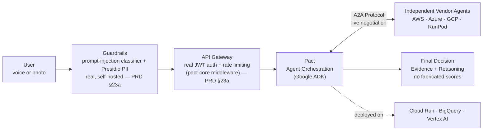
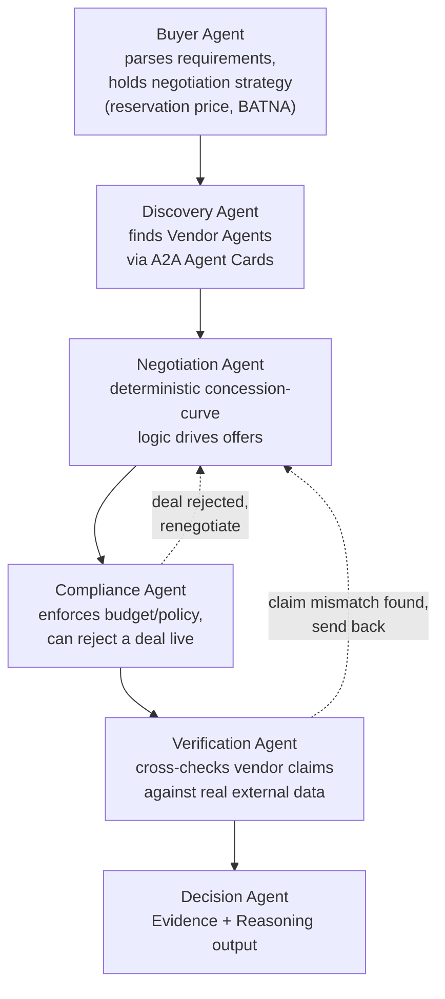
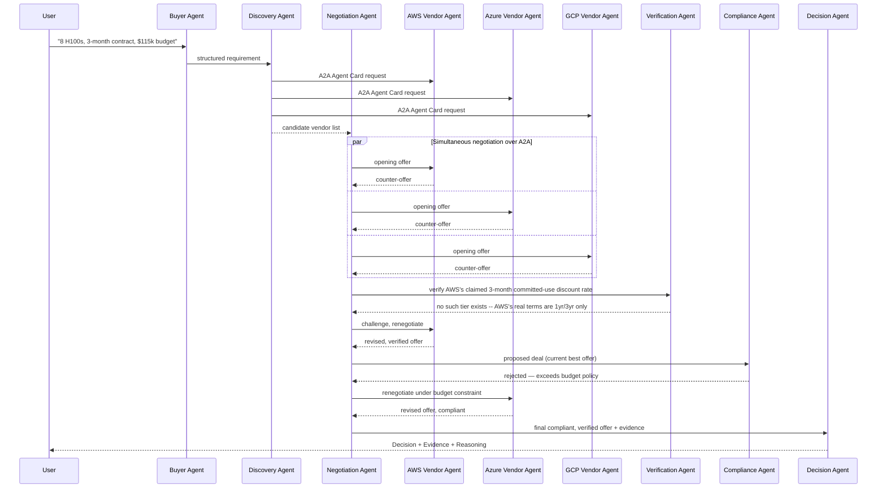
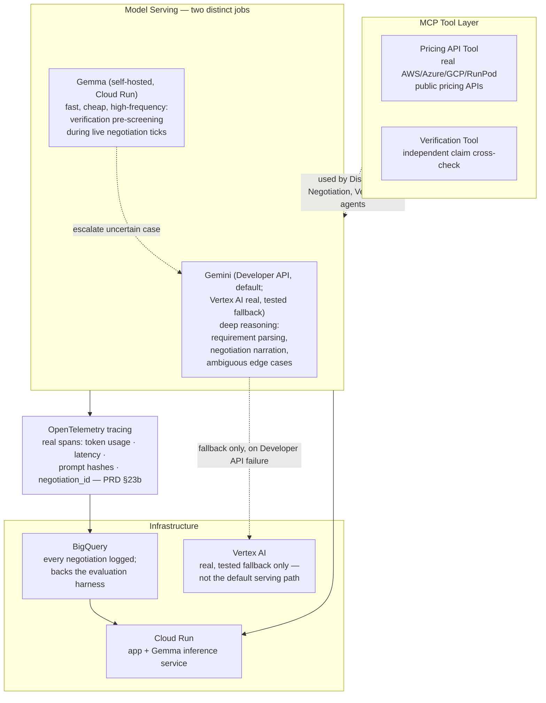
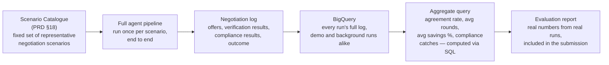

# Pact — Architecture

Five diagrams, each answering a different question, rather than one dense
diagram trying to answer all of them at once: a system overview (what is
this, at a glance), the agent orchestration detail (how the six agents
relate), a negotiation sequence (what actually happens, in order, during a
live run), the data/infrastructure layer (what's real, and where it
lives), and the evaluation harness pipeline (how a claim like "Pact saves
money" becomes a provable, re-runnable result).

---

## 1. System Overview

The high-level shape: what goes in, what orchestrates it, who it talks to
externally, what comes out.

**Read this as**: a user states a real requirement once. Everything else —
finding vendors, negotiating with several of them at once, verifying their
claims, enforcing policy, and deciding — happens autonomously inside Pact's
agent orchestration layer, with A2A as the actual channel Pact uses to
transact with vendors that are not part of the same system. Both Guardrails
and Gateway are real: photo intake is covered by a real transcription call
that feeds the same text-based guardrail text/voice already use; the
Gateway's JWT auth is real but off by default (`AUTH_REQUIRED=false`,
since this build has no end-user accounts to protect yet), and its rate
limiting is real and always on. Neither is a separate physical process —
both are implemented as `pact-core` middleware, a disclosed choice at this
single-operator scale (PRD §23a).

---

## 2. Multi-Agent Orchestration (inside ADK)

The six agents and how they hand off work to each other, including the two
feedback loops that make this a real negotiation rather than a fixed
pipeline.

**Why two feedback loops, not a straight line**: a real negotiation isn't a
pipeline that always finishes on the first pass. If the Verification Agent
catches a vendor claim that doesn't match real external data, or the
Compliance Agent finds the current best offer violates a policy constraint,
the Negotiation Agent has to go back and negotiate again — this is what
makes the system a genuine negotiator rather than a script that runs once
and reports whatever it got.

---

## 3. Negotiation Sequence (a real run, in order)

This is what actually happens, step by step, during one live negotiation —
including the two "wow" moments: a negotiating claim that fails
verification, and a rejected deal.

**Why this matters for the demo**: the two `-->>` moments where a vendor
gets challenged and a deal gets rejected are the literal, provable
difference between Pact and a static comparison tool — they only happen
because verification and compliance are real, running checks, not
decorative agent names.

---

## 4. Data & Infrastructure Layer

Where the real data comes from, how the two models divide labor, and what
runs where.

**Why Gemini and Gemma are both here, doing different jobs**: Gemma runs
locally/self-hosted for the high-frequency micro-decisions verification
needs during a live back-and-forth (many quick checks per negotiation
round) — using a large hosted model for every one of those would be slow
and unnecessary. Gemini is reserved for the actual deep reasoning: parsing
an ambiguous requirement, or narrating *why* a negotiation move was made in
plain language. This is a real model-selection decision, not two models
doing the same thing for stack-padding.

---

## 5. Evaluation Harness Pipeline

The path from "Pact saves money" as a claim to "Pact saves money" as a
provable, re-runnable result — the piece that turns the evaluation
harness (PRD §29) into something with real architectural weight, not just
a paragraph of intent.

**Why this matters**: every number in the evaluation report traces back
through this exact pipeline to a real, individually-logged negotiation run
— there is no manual computation, no hand-picked scenario, and no step
where a plausible-looking number could be substituted for a real one. The
same BigQuery table backs both a single demo run's replay (§3, FR-10) and
the full aggregate statistics — one real record, queried two different
ways, not two separately maintained sources of truth.

---

## Glossary

- **A2A (Agent2Agent protocol)** — the real transport Pact uses for
  negotiation between the Buyer/Negotiation Agent and independent Vendor
  Agents. Not internal plumbing — this is the actual negotiation channel.
- **Agent Card** — an A2A-native way for an agent to declare its identity
  and capabilities before interaction; used here so the Discovery Agent can
  verify a Vendor Agent is who it claims to be before negotiating with it.
- **MCP (Model Context Protocol)** — wraps external tools (the real pricing
  APIs, the verification data source) so agents can call them consistently.
- **BATNA** — Best Alternative To a Negotiated Agreement; the walk-away
  point the Negotiation Agent's concession-curve logic is built around.
- **Concession curve** — the deterministic function governing how much the
  Negotiation Agent is willing to move off its opening offer over
  successive rounds, based on time/urgency and the vendor's own behavior.
  This is what keeps negotiation *real* math, not an LLM inventing numbers.
- **API Gateway** — real JWT authentication and rate limiting for
  external-facing traffic, implemented directly as `pact-core`
  middleware/dependencies rather than a separate physical gateway
  process — a disclosed choice at this single-operator scale, not a gap.
  Auth is real but off by default (no end-user accounts exist yet to
  protect); rate limiting is real and always on. TLS termination is real
  via the deployment layer (ngrok) (PRD §23a).
- **Guardrails** — the real, self-hosted prompt-injection classifier and
  Microsoft Presidio PII detector protecting FR-1's intake, the one place
  raw user input reaches a model before validation — covering both
  modalities (text/voice directly; photo via a real transcription call
  feeding the same screen). A hosted alternative (Enkrypt AI) was
  evaluated and rejected after real side-by-side testing showed this
  combination catching more real attacks with no external dependency
  (PRD §23a).
- **CRISPE** — the prompt-structuring framework (Capacity/Role, Insight,
  Statement, Personality, Experiment) both of Pact's real Gemini prompts
  are documented against (PRD §16a).
- **model_traces** — the real BigQuery table (`infra/bigquery/schema.sql`)
  every OpenTelemetry span exports to: one row per real Gemini/Gemma/Vertex
  call, with token usage, latency, a prompt hash, and (where available) a
  correlating `negotiation_id` (PRD §23b).
