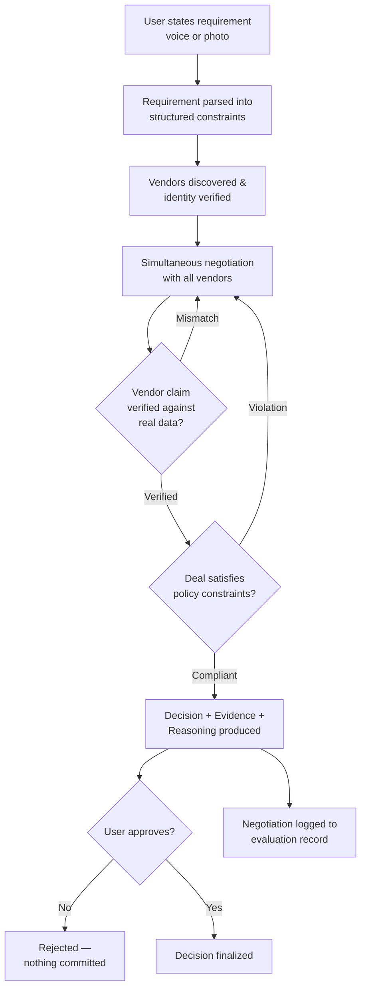
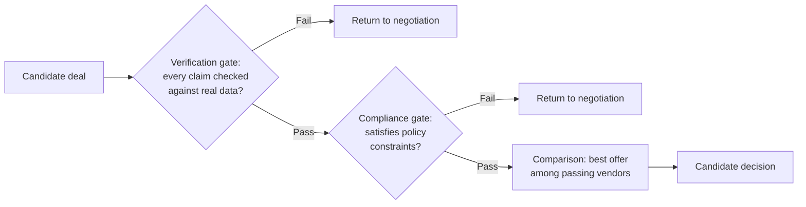

# Pact — Product Requirements Document

## 1. Document Control

| Field | Value |
|---|---|
| Product name | Pact |
| Document type | Product Requirements Document |
| Version | 1.0 |
| Status | Pre-build — architecture and scope locked |
| Context | AI Agent Builder Series 2026 — National Finale, B2B Services track, Problem Statement #7 (Vendor Evaluation) |
| Product scope | Autonomous agent-to-agent negotiation for B2B procurement, launch showcase: cloud infrastructure |
| Autonomy status | Negotiates, verifies, and decides autonomously; **finalization requires explicit human approval** — the system never executes a binding commitment on its own |

---

> *"Pact is a trustworthy autonomous procurement system where organisational
> agents negotiate directly with other organisational agents, every claim is
> independently verified, every decision is auditable, and every
> recommendation is grounded in real evidence rather than fabricated
> scores."*

---

## 2. Executive Summary

Pact is a six-agent system that autonomously negotiates B2B procurement
deals in real time. A Buyer Agent, representing an organization,
negotiates directly against independent Vendor Agents using the
Agent2Agent (A2A) protocol as the literal transport for that negotiation —
not internal coordination between parts of the same system. Every number
the system relies on is grounded in live, public, independently verifiable
data; nothing is fabricated, mocked, or presented as real when it isn't.

The launch showcase is cloud infrastructure procurement: a buyer needs
GPU/compute capacity, and Pact's agents discover, negotiate with, verify,
and select between cloud providers in real time. This category was chosen
because it is the one B2B procurement domain with clean, free, real-time
public pricing APIs — every number the system produces is independently
checkable. The product is architected to generalize to other procurement
categories over time (§34), but nothing outside the launch category is
simulated to make the system appear broader than it is.

The core shift is structural, not cosmetic: existing procurement software
digitizes the paperwork around procurement — a human still reads every
quote and makes every decision. Pact removes the human from the
negotiation itself, surfacing only a final, evidence-backed decision for
approval.

---

## 3. Problem Statement

**Official problem statement** (B2B Services track, Problem Statement #7):
*"Vendor evaluation remains time-consuming and highly manual."* Pact
treats this literally — not as inspiration for a generic AI feature, but
as the specific set of manual bottlenecks it removes:

1. Vendor evaluation and negotiation is manual by construction — a person
   must read every vendor's quote, understand it, and compare it against
   every other vendor's quote, often presented in incompatible formats.
2. Negotiation happens sequentially, over email or calls, typically across
   days or weeks, because a person can only hold one conversation at a
   time — vendors are never played against each other in real time.
3. There is no systematic way to verify a vendor's claim (a quoted
   discount, a stated capability) against independent ground truth; a
   buyer either trusts the vendor's word or spends additional time
   manually checking it.
4. Procurement decisions are rarely accompanied by a traceable record of
   why a specific vendor was chosen — the reasoning lives in an inbox
   thread, not a reviewable artifact.
5. As pricing changes frequently (as it does for cloud compute, via
   shifting discount tiers and committed-use terms), the manual burden of
   re-evaluating vendors compounds over time rather than staying fixed.

---

## 4. Product Vision

A world where procurement is something an organization's agents do for it
autonomously and verifiably — where a buyer states a real requirement once
and receives a negotiated, independently-verified decision in minutes, not
a stack of quotes to compare by hand.

Cloud infrastructure is the launch showcase, not the ceiling: the same
mechanism — one organization's agent transacting directly and verifiably
with another's — generalizes to any category of B2B procurement, making
Pact the trust layer for agent-to-agent commerce as that becomes the
default way organizations transact (§34).

---

## 5. Goals

- Negotiate simultaneously with multiple independent vendors in a single
  run, rather than sequentially.
- Verify every vendor claim made during negotiation against real,
  independent external data before it can influence a decision.
- Enforce explicit policy constraints (budget, blocked vendors, required
  certifications) as a hard gate, not a soft suggestion.
- Produce a final decision as a traceable Decision / Evidence / Reasoning
  artifact — never an unexplained composite score.
- Demonstrate the full negotiation-to-decision cycle live, end-to-end,
  against real external pricing data.
- Keep a human as the final approver of any binding commitment, even
  though the negotiation itself is autonomous.

---

## 6. Non-Goals

- Not a general-purpose procurement platform covering every category on
  day one — the launch scope is cloud infrastructure procurement only
  (§11), because it is the one category with real, live, public pricing
  data available; other categories are added only once an equivalent real
  data source exists for them, not simulated ahead of that.
- Not a contract-drafting or legal-risk-assessment tool — producing a
  risk score for a legal document without a real, grounded legal database
  would be exactly the kind of unverifiable claim this product is built to
  avoid making.
- Not a fully decentralized, blockchain-anchored identity system for
  agents — agent identity verification is scoped to what the A2A protocol
  already provides (Agent Cards), not a from-scratch trust infrastructure.
- Not an autonomous-execution system — Pact negotiates and decides, but
  does not commit an organization to a contract without a human
  approving that specific decision.

---

## 7. Target Users and Stakeholders

- **Procurement/finance decision-maker** — the primary user; states a
  requirement, reviews the final Decision/Evidence/Reasoning output,
  approves or rejects it.
- **Technical/founder-operator at a smaller organization** — a user
  without a dedicated procurement function, who benefits most from the
  negotiation happening autonomously rather than consuming their own time.
- **Vendor organizations** — the counterparties; represented by their own
  Vendor Agents, which Pact's Buyer Agent negotiates against directly over
  A2A rather than through a human sales cycle.
- **Evaluator/reviewer of the system** — anyone assessing the system's
  behavior needs the negotiation, verification, and decision process to be
  independently inspectable, not a black box.

---

## 8. Primary User Journey

1. The user states a real procurement requirement — by voice, or by
   photographing an invoice or pricing document, which is read directly
   rather than manually transcribed.
2. The requirement is parsed into structured constraints: budget ceiling,
   specification, contract terms.
3. Candidate vendors are discovered and their identities verified before
   any negotiation begins.
4. Negotiation runs simultaneously against every discovered vendor — offers
   and counter-offers, governed by explicit concession logic, not ad hoc.
5. Every factual claim a vendor makes during negotiation is checked against
   independent real data; a mismatch triggers a challenge and another
   negotiation round, not silent acceptance.
6. Before any deal is finalized, it is checked against explicit policy
   constraints; a violation sends it back for renegotiation.
7. A final decision is produced as a Decision / Evidence / Reasoning
   artifact and presented to the user for approval.
8. The user approves or rejects the decision; nothing is executed without
   this step.
9. The negotiation is logged in full, contributing to the aggregate
   evaluation record (§29).

---

## 9. Market Context and Differentiation

The status quo for B2B procurement negotiation is not the absence of
software — procurement platforms already exist and are widely adopted
(e.g. SAP Ariba, Coupa). What they automate is the *paperwork* around a
decision: requisitions,
approvals, supplier catalogs, invoice reconciliation. The negotiation
itself, and the verification of what a vendor claims during it, remains a
manual, human activity layered on top of that software, not replaced by
it. Pact's differentiation is structural rather than incremental: it moves
the negotiation and claim-verification steps themselves into an autonomous
system, with a human retained only at the final approval boundary (§21),
rather than adding an assistant feature on top of an otherwise unchanged
human-driven process.

**Positioning Statement**

> **For** procurement and finance decision-makers at organizations with
> recurring vendor spend **that need** vendor negotiation and claim
> verification to happen at the speed and scale a single human negotiator
> cannot match, **Pact** **is an** autonomous agent-to-agent procurement
> system **that** negotiates simultaneously with every vendor over real
> A2A, independently verifies every claim, and enforces policy as a hard
> gate — surfacing only a final, evidence-backed decision for approval.
>
> **Unlike** SAP Ariba or Coupa, which digitize the paperwork around a
> procurement decision a human still reads and makes, **Pact** **provides**
> the negotiation and verification themselves, carried out autonomously
> and simultaneously across every vendor, with every claim independently
> checked and every decision traceable to real evidence.

This is newly buildable, not merely newly built: standardized
cross-organization agent protocols (A2A) are a recent development. Before
a real, adopted protocol existed for one organization's agent to transact
directly with another's, "autonomous negotiation across organizational
boundaries" was a theoretical description, not an implementable one.

---

## 10. Business Model and Monetization

- **Primary model**: a usage-based fee tied to realized outcome — for
  example, a percentage of the savings achieved versus a vendor's opening
  offer, charged only on a successfully completed negotiation. This aligns
  the product's revenue directly with delivered value rather than charging
  regardless of outcome, similar in principle to how outcome-based
  procurement-consulting services are already priced in the market today.
- **Secondary model**: a flat subscription tier for organizations with
  high negotiation volume, offering unlimited negotiations within a
  procurement category in exchange for a predictable recurring fee instead
  of per-negotiation billing.
- **Longer-term model**: as the protocol-native scope expands (§34), a
  transaction-layer fee collected as more procurement categories and more
  independent Vendor Agents participate — the business model scales with
  the size of the network, not with headcount on either side of a deal.

🔶 *Assumption: a savings-percentage fee structure would be broadly
acceptable to buyers, since it only charges when real value is delivered
— reasoned from how common outcome-based pricing already is in adjacent
service categories (e.g., cost-reduction consultancies), not validated
with actual prospective customers of this specific product.*

---

## 11. Current Working-Build Scope

- **Domain**: cloud infrastructure procurement (compute/GPU capacity)
  against major public cloud providers, selected specifically because
  real, free, live public pricing APIs exist for this category.
- **Agents**: Buyer, Discovery, Negotiation, Compliance, Verification,
  Decision (§13 gives functional requirements for each).
- **Protocols**: A2A (Agent2Agent) for negotiation transport and agent
  identity between Pact's Negotiation Agent and each independent Vendor
  Agent; MCP (Model Context Protocol) for wrapping every external tool
  call (pricing APIs, verification source, voice/vision input) behind one
  consistent interface; Google ADK for orchestrating the agent graph.
- **Models**: Gemini for deep reasoning (requirement parsing, negotiation
  narration, ambiguous-case resolution, final Decision/Reasoning
  generation) and Gemma, self-hosted, for high-frequency verification
  pre-screening during live negotiation ticks, escalating uncertain cases
  to Gemini — two distinct roles, not duplicated capability.
- **Infrastructure**: Cloud Run for the application and the self-hosted
  Gemma inference service; Vertex AI as the serving backbone for Gemini in
  production; BigQuery as the authoritative store for the negotiation log
  and evaluation-harness statistics.
- **Development tooling** (not part of the running system): Google AI
  Studio for iterating on prompts and agent behavior during the build;
  Google Antigravity as part of the development workflow.

### Google Technology Stack

| Technology | Role in Pact |
|---|---|
| Google AI Studio | Development-time iteration on prompts and agent behavior; not part of the running system. |
| Gemini | Deep reasoning: requirement parsing, negotiation-move narration, ambiguous-case resolution, final Decision/Reasoning generation. |
| Gemma | Self-hosted, high-frequency verification pre-screening during live negotiation; escalates uncertain cases to Gemini. |
| Google ADK | Orchestrates the six-agent pipeline (Buyer → Discovery → Negotiation → Compliance/Verification → Decision). |
| MCP (Model Context Protocol) | Wraps every external tool call agents make — pricing APIs, the verification data source, voice/vision input parsing — behind one consistent interface. |
| A2A (Agent2Agent) | The literal transport for negotiation between Pact's Negotiation Agent and each independent Vendor Agent; carries the Agent Card used for vendor identity verification (§17). |
| Vertex AI | Production serving backbone for Gemini. |
| Cloud Run | Deployment target for the application and the self-hosted Gemma inference service. |
| BigQuery | Authoritative store for every negotiation log and the evaluation-harness aggregate statistics (§29). |
| Google Antigravity | Development workflow tooling used during the build; not part of the running system. |

---

## 12. Implemented Capabilities versus Future Evolution

| Dimension | Current build | Future evolution |
|---|---|---|
| Procurement category | Cloud infrastructure only | Additional categories, added only once a real public pricing source exists |
| Vendor participation | A fixed set of major cloud providers | Any organization with an A2A-compliant Vendor Agent, dynamically discovered |
| Negotiation scope | Single requirement per session | Portfolio-level negotiation across multiple simultaneous requirements |
| Verification source | Public pricing APIs | Broader independent data sources per category |
| Execution | Human-approved, non-binding until approval | Optional pre-authorized auto-execution within a stated policy envelope |
| Monetization | Not implemented in this build | Usage-based fee per completed negotiation (§10) |

---

## 13. Functional Requirements

| ID | Title | Requirement | Rationale | Acceptance Criteria |
|---|---|---|---|---|
| FR-1 | Requirement intake | The system shall accept a procurement requirement via spoken input or a photographed document, and extract structured constraints from it. | Removes manual form-filling as the entry barrier. | A spoken or photographed requirement produces a structured object with budget, specification, and contract-length fields; no field is populated with an invented value not present in the input. |
| FR-2 | Vendor discovery | The system shall discover candidate Vendor Agents and verify their declared identity before negotiating with them. | Prevents negotiating with an unverified or misrepresented counterparty. | Every Vendor Agent's identity is checked via its Agent Card before any offer is sent to it. |
| FR-3 | Simultaneous negotiation | The system shall negotiate with all discovered vendors concurrently, not sequentially. | Real competitive pressure requires simultaneity; sequential negotiation cannot produce it. | All discovered vendors receive an opening offer within the same negotiation cycle; offers to different vendors do not block on each other. |
| FR-4 | Deterministic concession logic | Negotiation offers shall be governed by an explicit, deterministic concession function (reservation price, BATNA, time-decay), not free-form generation. | Guards against negotiation logic that only appears reasoned but is not reproducible or defensible. | Given identical inputs, the negotiation produces identical offer sequences; every offer traces to the concession function's parameters. |
| FR-5 | Claim verification | Every factual claim a vendor makes during negotiation shall be checked against independent, real external data before it can affect the outcome. | Prevents a vendor's unverified claim from silently determining the decision. | A claim that does not match the independent source is flagged and triggers a renegotiation round; a claim that matches is marked verified. |
| FR-6 | Policy enforcement | Any candidate deal shall be checked against explicit policy constraints (budget ceiling, blocked vendors, required certifications) before it can be finalized. | Ensures autonomous negotiation cannot silently violate stated organizational policy. | A deal violating a policy constraint is rejected and returned for renegotiation, with the specific violated constraint named. |
| FR-7 | Evidence-based decision output | The final output shall be a fixed Decision / Evidence / Reasoning structure. | Prevents the system from ever presenting an unexplained confidence score as the basis for a decision. | Every produced decision includes at least one evidence item traceable to a real source, and a reasoning statement referencing that evidence. |
| FR-8 | Human approval gate | No negotiated deal shall be executed as binding without explicit human approval. | Keeps a human accountable for the final commitment, even though negotiation is autonomous. | The system has no code path that finalizes a binding commitment without a recorded approval action. |
| FR-9 | Negotiation logging | Every negotiation run shall be logged in full (offers, counter-offers, verification results, final outcome). | Backs the audit trail (§22) and the aggregate evaluation record (§29). | Every negotiation run produces a complete, queryable log entry, regardless of whether the run was a demo or a background evaluation run. |
| FR-10 | Negotiation replay UI | The system shall render each logged negotiation (§22) as a human-readable, timestamped timeline in the UI, not only as a queryable backend record. | An audit trail nobody can see in the demo doesn't function as a trust signal to a judge or user in the moment. | For any completed run, a user can open a timeline view showing every offer, verification check, compliance check, and outcome in chronological order without querying the database directly. |

---

## 14. Non-Functional Requirements

| Attribute | Requirement | Acceptance Criteria |
|---|---|---|
| Accuracy of grounding | No number shown to a user is fabricated, invented, or presented as real without a real source. | Every numeric value in the UI, log, or output traces to a live API call, a real computation, or something literally present in a user-provided input. |
| Reproducibility | Given the same inputs, the deterministic negotiation logic produces the same sequence of offers. | Re-running the same scenario against the same vendor state produces an identical offer sequence. |
| Auditability | Every decision is independently reviewable after the fact. | The full negotiation log for any run can be retrieved and inspected without needing to re-run the negotiation. |
| Latency | A full negotiation-to-decision cycle completes within a demo-appropriate window. | Target: under ~60 seconds end-to-end for a single-requirement negotiation. |
| Graceful degradation | A failure in an external dependency (pricing API unreachable) is disclosed, never silently masked. | On an external API failure, the system surfaces a visible, honest status rather than substituting a plausible-looking invented value. |

---

## 15. Data and Input Requirements

- **Requirement input**: spoken audio (converted to text) or an image
  containing real pricing/invoice information; both are parsed into a
  structured requirement object (budget, specification, contract terms).
- **Vendor pricing data**: consumed live from each vendor's real, public
  pricing API — never pre-loaded, cached indefinitely, or hand-entered as
  a substitute for a live call.
- **Verification data**: an independent source distinct from whatever a
  vendor itself claims during negotiation, used specifically to catch a
  mismatch between what a vendor states and what is independently true.
- **Policy configuration**: an explicit, structured set of constraints
  (budget ceiling, blocked vendors, required certifications) supplied
  ahead of a negotiation run, not inferred silently.

---

## 16. Negotiation Method and Assumptions

Negotiation offers are generated by a deterministic concession function
parameterized by a reservation price and a BATNA (Best Alternative To a
Negotiated Agreement), with concessions moving over successive rounds
according to a time-decay schedule rather than being generated freely by
a language model. Gemini is used only to *narrate* the reasoning
behind a given move in plain language for the audit trail and the user
interface — it does not determine the offer value itself.

🔶 *Assumption: a time-decay concession schedule is an appropriate
negotiation strategy for this category of purchase — reasoned from
standard negotiation theory, not validated against real negotiated
outcomes in this specific market, since no real negotiation history for
this product exists yet.*

---

## 17. Agent Identity and Verification Requirements

Every Vendor Agent must present a valid identity declaration (an A2A
Agent Card) before the Discovery Agent will pass it to the Negotiation
Agent as a candidate. Every factual claim made by a Vendor Agent during
negotiation is independently checked by the Verification Agent against a
real external data source before it is allowed to influence the outcome;
an unverifiable or mismatched claim triggers a challenge, not silent
acceptance. This scope is deliberately bounded to identity-declaration and
claim-checking — it does not implement a general-purpose trust or
reputation infrastructure beyond what is needed for a single negotiation.

**Vendor Agent operation, disclosed explicitly**: in the current build,
each Vendor Agent (AWS, Azure, GCP, RunPod) is implemented and operated by
the Pact team as a genuinely separate, independently deployed
A2A-addressable service — each with its own Agent Card and process
boundary — that wraps that provider's real, live public pricing API. This
satisfies the technical/protocol definition of cross-organization
negotiation Pact's architecture is built around: separate identities,
separate services, real A2A messages, real external pricing data. It does
not claim that Amazon, Microsoft, or Google themselves operate these
agents or have partnered with Pact — no such partnership exists or is
claimed.

---

## 18. Negotiation Scenario Catalogue

A fixed set of representative negotiation scenarios is used both for
pre-launch validation and for the aggregate evaluation record (§29),
varying:

| Scenario dimension | Variation covered |
|---|---|
| Budget tightness | Budget comfortably above market rate; budget at market rate; budget below what any vendor can meet |
| Requirement specificity | Fully specified requirement; ambiguous requirement requiring interpretation |
| Vendor behavior | Vendor offers accurate information; vendor makes a claim that does not match independent data |
| Policy constraints | No additional constraints beyond budget; an active blocked-vendor or certification requirement |
| Outcome | A compliant deal is reached; no compliant deal exists and the system must report that honestly |

### Flagship Demonstration Scenario

The live demonstration and demo video run the following scenario against
real external data, chosen because it exercises every gate in the
Decision Policy (§19) and both of the system's core "wow" moments:

- **Requirement**: 8 H100 GPUs, 3-month contract, $115,000 budget ceiling
  (calibrated against real AWS/Azure pricing for this exact spec, not a
  round number — see the note on real pricing below).
- Vendors are discovered and identity-verified (FR-2), then negotiate
  simultaneously (FR-3).
- During negotiation, AWS's counter-offer claims a specific committed-use
  discount rate for the 3-month term. When the Verification Agent
  cross-checks that claim against AWS's actual live published pricing
  tiers, it finds AWS's real Reserved Instance terms exist only in 1-year
  and 3-year lengths — there is no 3-month committed-use tier at all, so
  the claimed discount cannot be legitimate by construction, not merely a
  mismatched number. The claim is rejected and AWS is challenged to
  renegotiate (FR-5) — the first "wow" moment: **a negotiating claim that
  doesn't survive independent verification.**
- The current best offer is then checked against policy and rejected by
  the Compliance Agent for exceeding the budget ceiling, forcing
  renegotiation with a different vendor (FR-6) — the second "wow" moment:
  **a compliant offer beating a rejected one on policy grounds, not price
  alone.**
- The renegotiated, compliant offer proceeds to the Decision Agent, which
  produces a Decision / Evidence / Reasoning artifact (FR-7) for human
  approval (FR-8).
- The full run is visible afterward as a timestamped replay (FR-10), so a
  reviewer can independently verify both wow moments genuinely happened
  rather than being narrated after the fact.

This matches the corresponding sequence diagram in `ARCHITECTURE.md` §3
exactly, so the written submission and the live/video demonstration are
directly cross-checkable against each other.

**Why $115,000, specifically**: this is not a round number chosen for
convenience — it is calibrated against real, live-checked pricing for
this exact spec. AWS's real on-demand rate for 8x H100 (`p5.48xlarge`) is
$55.04/hour, live from the AWS Price List Bulk API; even after AWS's
false claim is corrected, its honest 3-month price ($118,886.40) still
exceeds this budget, which is what makes wow moment #2 real rather than
scripted. Azure's real on-demand rate for the equivalent SKU
(`Standard_ND96isr_H100_v5`) is $98.32/hour, but Azure — unlike AWS — also
publishes real, immediately-available Spot pricing (~$18.17/hour, live
from the Azure Retail Prices API) with no minimum commitment, an ~81.5%
real discount that legitimately brings its 3-month price to roughly
$39,000 — comfortably within budget. Both AWS and Azure's Reservation
terms exist only in 1-year and 3-year lengths, confirmed live from both
providers' own pricing APIs, which is precisely why a 3-month
committed-use claim can never be legitimate in the first place (§17).

### Acceptance Scenarios (Gherkin)

**Scenario: Vendor negotiating claim fails independent verification**
- **Given** a live negotiation is underway with AWS as a candidate vendor
- **And** AWS's counter-offer claims a committed-use discount rate for a
  3-month term
- **When** the Verification Agent cross-checks that claim against AWS's
  actual live published pricing tiers
- **Then** it finds AWS's real Reserved Instance terms exist only in
  1-year and 3-year lengths, so no legitimate 3-month committed-use
  discount exists — the claim is marked unverified by construction, and a
  renegotiation round is triggered with AWS (FR-5)

**Scenario: Compliance rejects a deal that satisfies price but not policy**
- **Given** the current best offer satisfies the buyer's price and
  specification requirements
- **And** an explicit budget-ceiling policy constraint is active
- **When** the Compliance Agent evaluates the candidate deal against that
  constraint
- **Then** the deal is rejected, the specific violated constraint is
  named, and the Negotiation Agent renegotiates with an alternative
  vendor (FR-6)

**Scenario: Human approval gates every binding commitment**
- **Given** a candidate deal has passed both the Verification gate and
  the Compliance gate
- **When** the Decision Agent produces a Decision / Evidence / Reasoning
  artifact
- **Then** the deal is presented to the user for approval and is not
  executed as binding until the user explicitly approves it (FR-8)

---

## 19. Decision Policy

A candidate deal proceeds to finalization only if it passes, in order:
(1) verification — every claim underpinning it has been checked against
independent data, (2) compliance — it satisfies every active policy
constraint, and (3) comparison — among all vendors that pass (1) and (2),
the one best satisfying the buyer's stated requirement is selected. A deal
failing any gate is sent back to the Negotiation Agent rather than
finalized with an unresolved issue.

---

## 20. Business-Impact Estimation

Impact is expressed only as figures directly computable from a
negotiation's own real inputs and outputs — for example, the percentage
difference between a vendor's opening offer and the final negotiated
price. 🔵 *Open Question: no baseline or target figure is stated here in
advance of running the evaluation harness (§29) — stating one now, before
real data exists, would itself be exactly the kind of unverifiable claim
this product exists to avoid making.*

---

## 21. Human Decision and Governance

Pact's autonomy boundary is explicit: the system negotiates, verifies, and
recommends a decision entirely on its own, but a human must explicitly
approve a decision before it is treated as binding. This mirrors the
principle that autonomous reasoning and autonomous commitment are
different things — the former is what this product automates, the latter
remains a human responsibility. Every decision presented for approval
carries its full Evidence and Reasoning, so approval is an informed
action, not a formality.

---

## 22. Audit Chain and Evidence Package

Each completed negotiation produces a reviewable package containing: the
full sequence of offers and counter-offers exchanged, every verification
check performed and its result, every compliance check performed and its
result, the final Decision / Evidence / Reasoning output, and a timestamp
for every step. This package is what backs both the human approval step
(§21) and any later review of why a specific decision was made.

### Key UI Surfaces

Two screens carry the product's trust claims and are what a user or
reviewer actually sees, not just what's logged:

- **Decision / Evidence / Reasoning view** — shown after a negotiation
  finalizes (FR-7). Displays: the recommended vendor and final terms; each
  piece of evidence backing the decision, individually attributed to its
  real source (live pricing API response, verification check result,
  policy check result); the reasoning statement connecting that evidence
  to the recommendation; and the human approval action (FR-8) as the only
  way to finalize it.
- **Negotiation Replay Timeline** (FR-10) — a chronological, timestamped
  view of one completed run: every offer and counter-offer per vendor, the
  verification check performed on each claim and its result, the
  compliance check performed on the resulting deal and its result, and any
  renegotiation triggered by either. Built directly from the same audit
  package described above — the two screens are two views onto one real
  record, not separately maintained.

---

## 23. System Architecture

Full component diagrams, the multi-agent orchestration detail, the
negotiation sequence, and the data/infrastructure layer are maintained
separately in `ARCHITECTURE.md` rather than duplicated here. In summary:
a six-agent pipeline (Buyer, Discovery, Negotiation, Compliance,
Verification, Decision) is orchestrated by Google ADK, negotiates over A2A
with external Vendor Agents, calls external tools via MCP, and is backed
by Gemini (via Vertex AI) and self-hosted Gemma as two distinct
model-serving tiers, with BigQuery as the logging and evaluation-harness
data warehouse, all deployed on Cloud Run.

---

## 24. API and Communication Requirements

- **A2A** is the transport for all negotiation messages between the
  Negotiation Agent and each Vendor Agent, and carries the Agent Card
  used for identity verification (§17).
- **MCP** wraps every external tool call: pricing data retrieval, the
  independent verification lookup, and the voice/vision input parsing
  tools, so agents interact with external systems through one consistent
  interface rather than bespoke integrations per tool.

---

## 25. Persistence Model

BigQuery is the authoritative store for negotiation logs and
evaluation-harness results — chosen specifically so aggregate statistics
(§29) can be computed directly from real logged runs, via SQL against the
same warehouse, rather than maintained separately by hand. It is not used
to store anything a user would consider personal or sensitive; negotiation
content is business pricing/requirement data, not personal data.

---

## 26. Security, Privacy and Compliance Boundaries

- Vendor pricing data consumed is public by construction (public pricing
  APIs); no private or credentialed vendor data is accessed.
- No end-user personal data is required for the core negotiation flow — a
  requirement is a business specification (budget, capacity, contract
  terms), not personal information.
- Credentials for any API access are held server-side and are not exposed
  to the client or logged in plaintext.
- **Explicit non-claim**: this product does not claim formal security
  certification, penetration testing, or compliance audit of any kind —
  none has been performed, and none is claimed.

---

## 27. Error Handling and Failure Behaviour

- **External pricing API unreachable**: the affected vendor is marked
  unavailable for that run and disclosed as such in the output; the
  system does not substitute an invented price to keep the run looking
  complete.
- **No vendor can meet the stated requirement/budget**: the system reports
  "no compliant deal found" explicitly, rather than forcing a
  non-compliant deal through.
- **Ambiguous or incomplete requirement input**: the parsing step resolves
  ambiguity through reasoning where possible, and surfaces what it could
  not resolve rather than silently guessing.
- **Verification source unreachable**: a claim that cannot be verified is
  treated as unverified, not as verified-by-default.

---

## 28. Dependencies

- **Technical**: live availability of the external cloud-provider pricing
  APIs during a negotiation run; availability of the self-hosted
  verification model service.
- **External**: none — no third-party partnership, credential grant, or
  external approval is required to operate at the current build scope;
  every data source used is public.
- **Team**: solo build — no cross-functional handoffs are required, but
  there is also no redundancy if the sole contributor is blocked on
  something; scope decisions (§6) are set conservatively in part to manage
  this risk directly.

---

## 29. Evaluation and Success Criteria

- Negotiation completes end-to-end against real external pricing data with
  zero fabricated numbers anywhere in the output.
- The verification step demonstrably catches at least one real claim/data
  mismatch across the scenario catalogue (§18).
- The compliance step demonstrably rejects at least one non-compliant deal
  across the scenario catalogue.
- Aggregate statistics (average savings percentage, negotiation success
  rate, rounds-to-agreement) are computed from real logged runs across the
  full scenario catalogue, not a single cherry-picked run.

---

## 30. Testing Strategy

- **Unit tests**: the deterministic concession function, verification
  matching logic, and compliance rule evaluation, each tested in
  isolation against known inputs and expected outputs.
- **Integration tests**: each agent's interaction with its real external
  dependency (pricing API, verification source) tested against live
  calls, not mocks, wherever feasible.
- **End-to-end tests**: the full scenario catalogue (§18) run through the
  complete pipeline, asserting on final decisions and on the two
  demo-critical behaviors (a caught claim mismatch, a rejected deal).
- **Failure-path tests**: each error-handling behavior in §27 exercised
  directly, not just the success path.

---

## 31. Risks and Mitigations

- **Risk**: negotiation logic could appear scripted rather than genuinely
  reasoned. **Mitigation**: deterministic concession logic drives every
  number; the language model only narrates, never decides (§16).
- **Risk**: a live external dependency fails during a real demonstration.
  **Mitigation**: explicit, visible degradation rather than a silent
  fallback (§27).
- **Risk**: scope expands under time pressure to categories without real
  data sources, reintroducing fabrication risk. **Mitigation**: §6's
  non-goals exist specifically to hold this boundary.
- **Risk**: the value of autonomous cross-organization negotiation is not
  immediately obvious to an evaluator unfamiliar with the category.
  **Mitigation**: the primary user journey (§8) and business-impact
  framing (§20) lead with the outcome, not the mechanism.
- **Risk**: the proposed monetization model (§10) is assessed as
  unrealistic. **Mitigation**: it is explicitly tagged as an unvalidated
  assumption rather than presented as confirmed, consistent with this
  document's evidence-tagging discipline throughout.

---

## 32. Limitations and Explicit Non-Claims

- Does not claim to negotiate better than a skilled human negotiator in
  every circumstance — only that it negotiates simultaneously,
  verifiably, and without the sequential time cost a human incurs.
- Does not claim any accuracy or savings figure not directly produced by
  the evaluation harness's own real runs (§29).
- Does not claim to cover any procurement category beyond the current
  build scope (§11).
- Does not claim formal legal, security, or compliance certification of
  any kind (§26).
- Does not claim the proposed monetization model (§10) has been validated
  with real customers.
- Does not claim that AWS, Microsoft, or Google operate or endorse the
  Vendor Agents used in this build — they are independently implemented
  by the Pact team as separate A2A services wrapping each provider's real
  public pricing data (§17).

---

## 33. Delivery Acceptance Criteria

1. All functional requirements (§13) are implemented and pass their
   stated acceptance criteria.
2. All non-functional requirements (§14) are met, verified via the
   testing strategy (§30).
3. The full scenario catalogue (§18) runs end-to-end without a fabricated
   value appearing anywhere in the output.
4. The repository contains this document, the architecture documentation,
   complete source code, and a setup guide sufficient for an independent
   party to run the system.
5. Aggregate evaluation statistics (§29) are computed and included in the
   submission alongside a live demonstration.

---

## 34. Roadmap

- **Current release**: cloud infrastructure procurement only, negotiated
  against a fixed set of major providers with live public pricing.
- **Near-term**: additional procurement categories, added only once a real
  public pricing or verification data source is identified for each —
  never simulated ahead of that.
- **Longer-term**: an open, protocol-native commerce layer where any
  organization's own Vendor Agent can participate directly, without
  platform-specific onboarding, monetized via the transaction-layer model
  described in §10.

---

## 34a. Assumptions & Open Questions Log

Every unvalidated assumption (🔶) and open question (🔵) tagged inline
throughout this document, consolidated in one place:

| Tag | Location | Item |
|---|---|---|
| 🔶 Assumption | §10 Business Model | A savings-percentage fee structure would be broadly acceptable to buyers — reasoned from outcome-based pricing norms in adjacent services, not validated with actual prospective customers. |
| 🔶 Assumption | §16 Negotiation Method | A time-decay concession schedule is an appropriate negotiation strategy for this category — reasoned from standard negotiation theory, not validated against real negotiated outcomes, since none exist yet for this product. |
| 🔵 Open Question | §20 Business-Impact Estimation | No baseline or target savings figure is stated in advance of running the evaluation harness (§29) — doing so before real data exists would itself be an unverifiable claim. |

---

## 35. Glossary

- **A2A (Agent2Agent protocol)** — the transport used for negotiation
  between the Buyer/Negotiation Agent and independent Vendor Agents.
- **Agent Card** — an A2A-native identity and capability declaration used
  to verify a Vendor Agent before negotiating with it.
- **MCP (Model Context Protocol)** — the interface agents use to call
  external tools (pricing APIs, verification source, input parsing)
  consistently.
- **BATNA** — Best Alternative To a Negotiated Agreement; the walk-away
  point underlying the concession function.
- **Concession curve** — the deterministic function governing how far the
  Negotiation Agent moves off its opening offer over successive rounds.

---

## 36. Final Product Boundary

Pact automates the negotiation and evidence-gathering that precede a
procurement decision. It does not automate the decision to commit an
organization to that outcome — that remains an explicit human action,
every time.
